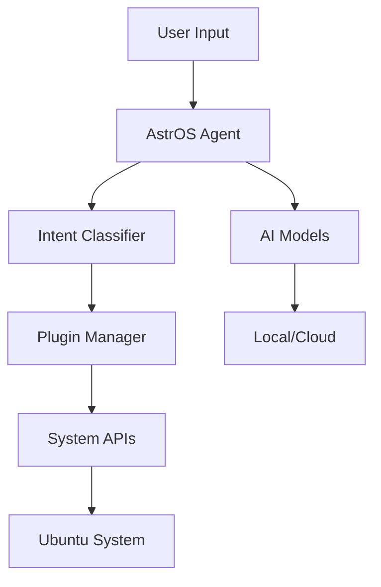

# AstrOS Development Guide - Complete Process Overview

## Table of Contents
1. [Introduction](#introduction)
2. [Development Philosophy](#development-philosophy)
3. [Complete Development Pipeline](#complete-development-pipeline)
4. [Phase-by-Phase Implementation](#phase-by-phase-implementation)
5. [Technical Architecture](#technical-architecture)
6. [Tools and Technologies](#tools-and-technologies)
7. [Development Workflow](#development-workflow)
8. [Open Source Strategy](#open-source-strategy)

---

## Introduction

This document outlines the complete process for developing AstrOS - an AI-integrated operating system based on Ubuntu LTS. This is your master guide for understanding how to transform a standard Ubuntu distribution into an intelligent, AI-powered operating system while maintaining open source principles.

### What We're Building
- **Base**: Ubuntu 24.04 LTS (stable, well-supported foundation)
- **AI Layer**: Python-based AI agent system with modular architecture
- **Integration**: Deep system integration for natural language control
- **Distribution**: Custom ISO with AI components pre-installed
- **Community**: Open source project with contributor ecosystem

---

## Development Philosophy

### Core Principles
1. **Build on Solid Foundation**: Use Ubuntu LTS instead of creating OS from scratch
2. **Modular Architecture**: AI components are separate, upgradeable modules
3. **Privacy First**: Local processing by default, cloud optional
4. **Developer Friendly**: Modern Python stack with good tooling
5. **Community Driven**: Open development with transparent processes

### Why This Approach Works
- **Faster Development**: Don't reinvent kernel, drivers, package management
- **Hardware Compatibility**: Inherit Ubuntu's excellent hardware support
- **Security Updates**: Benefit from Ubuntu's security team
- **Ecosystem**: Access to thousands of packages and applications
- **Familiarity**: Developers already know Ubuntu/Debian ecosystem

---

## Complete Development Pipeline

### Stage 0: Foundation (Current Stage)
```
Repository Setup → Documentation → Community Guidelines → Build Infrastructure
```

### Stage 1: Core Development
```
Ubuntu Base → Custom Packages → AI Agent → System Integration → Basic ISO
```

### Stage 2: AI Integration
```
Plugin System → Natural Language Processing → System APIs → User Interface
```

### Stage 3: Distribution
```
Automated Builds → Testing Pipeline → Release Process → Update System
```

### Stage 4: Community
```
Plugin Marketplace → Documentation → Tutorials → Community Growth
```

---

## Phase-by-Phase Implementation

### Phase 1: Ubuntu Customization (Weeks 1-4)

#### Step 1.1: Set Up Build Environment
```bash
# Install required tools
sudo apt update
sudo apt install -y debootstrap squashfs-tools genisoimage syslinux-utils

# Install Ubuntu development tools
sudo apt install -y ubuntu-dev-tools pbuilder devscripts
```

#### Step 1.2: Create Base Ubuntu System
```bash
# Create chroot environment
sudo debootstrap --arch=amd64 noble ubuntu-base http://archive.ubuntu.com/ubuntu/

# Customize the base system
sudo chroot ubuntu-base /bin/bash
# Install desktop environment, drivers, essential packages
```

#### Step 1.3: Package AstrOS Components
```bash
# Create .deb packages for AstrOS components
# Use standard Debian packaging tools
debuild -us -uc
```

#### Step 1.4: Build Custom ISO
```bash
# Use tools like Cubic or custom scripts
# Include AstrOS packages in the ISO
# Configure default settings and branding
```

### Phase 2: AI Agent Development (Weeks 5-12)

#### Step 2.1: Core Agent Architecture
```python
# astros-agent/
├── src/
│   ├── core/           # Core agent functionality
│   ├── plugins/        # Plugin system
│   ├── ai/            # AI integration layer
│   ├── system/        # System integration
│   └── ui/            # User interface components
├── tests/
├── docs/
└── scripts/
```

#### Step 2.2: System Integration Points
- D-Bus integration for system communication
- Systemd services for background operation
- GNOME Shell extensions for UI integration
- File system monitoring and management
- Audio/voice input handling

#### Step 2.3: AI Processing Pipeline
```python
# Natural Language → Intent Recognition → Action Execution → Response
class AstrOSAgent:
    def __init__(self):
        self.nlp_processor = NLPProcessor()
        self.intent_classifier = IntentClassifier()
        self.action_executor = ActionExecutor()
        self.plugin_manager = PluginManager()
    
    async def process_command(self, user_input: str):
        # Process natural language input
        processed = await self.nlp_processor.process(user_input)
        
        # Classify intent
        intent = await self.intent_classifier.classify(processed)
        
        # Route to appropriate plugin
        plugin = self.plugin_manager.get_plugin(intent.domain)
        result = await plugin.execute(intent)
        
        return result
```

### Phase 3: Plugin Ecosystem (Weeks 13-20)

#### Step 3.1: Plugin Architecture
```python
# Base plugin interface
class BasePlugin:
    def __init__(self):
        self.name = ""
        self.version = ""
        self.permissions = []
    
    async def initialize(self):
        pass
    
    async def execute(self, intent: Intent) -> Response:
        pass
    
    async def shutdown(self):
        pass
```

#### Step 3.2: Core Plugins
1. **File Management Plugin**: Organize, search, manage files
2. **System Control Plugin**: Control system settings, services
3. **Development Plugin**: Coding assistance, project management
4. **Communication Plugin**: Manage emails, messages, calendar
5. **Media Plugin**: Control music, videos, photos

#### Step 3.3: Plugin Distribution
- Plugin registry/marketplace
- Automated testing and validation
- Digital signing for security
- Dependency management

### Phase 4: Distribution and Updates (Weeks 21-24)

#### Step 4.1: Automated Build Pipeline
```yaml
# GitHub Actions workflow
name: Build AstrOS ISO
on:
  push:
    branches: [main, develop]
  
jobs:
  build-iso:
    runs-on: ubuntu-latest
    steps:
      - uses: actions/checkout@v3
      - name: Set up build environment
        run: ./scripts/setup-build-env.sh
      - name: Build packages
        run: ./scripts/build-packages.sh
      - name: Create ISO
        run: ./scripts/create-iso.sh
      - name: Test ISO
        run: ./scripts/test-iso.sh
```

#### Step 4.2: Update System
- Delta updates for efficiency
- Rollback capability for safety
- Plugin updates separate from system updates
- Security update prioritization

---

## Technical Architecture

### System Layers
```
┌─────────────────────────────────────┐
│         User Interface Layer        │  ← GNOME Shell, GUI apps
├─────────────────────────────────────┤
│         AstrOS Agent Layer          │  ← Python agent, plugins
├─────────────────────────────────────┤
│       System Integration Layer      │  ← D-Bus, systemd, APIs
├─────────────────────────────────────┤
│         Ubuntu Base Layer           │  ← Standard Ubuntu system
└─────────────────────────────────────┘
```

### Component Communication


### Data Flow
1. User provides natural language input (voice/text)
2. AstrOS Agent processes and classifies intent
3. Appropriate plugin is selected and executed
4. Plugin interacts with system APIs
5. Results are returned to user with natural language response

---

## Tools and Technologies

### Development Stack
- **Primary Language**: Python 3.12+
- **Framework**: FastAPI for internal APIs, asyncio for concurrency  
- **AI/ML**: Transformers, spaCy, local models + API integration
- **System Integration**: D-Bus, systemd, GNOME APIs
- **UI**: GTK4, GNOME Shell extensions, web technologies
- **Database**: SQLite for local data, Redis for caching

### Build Tools
- **Package Building**: dpkg-buildpackage, debhelper
- **ISO Creation**: live-build, cubic, custom scripts
- **Testing**: pytest, tox, GitHub Actions
- **Documentation**: Sphinx, MkDocs
- **Containerization**: Docker for consistent builds

### Development Environment
```bash
# Recommended development setup
# Use Ubuntu 24.04 LTS as development platform
# Virtual machines for testing ISO builds
# Docker for containerized development
# VS Code with Python extensions
```

---

## Development Workflow

### Daily Development Process
1. **Morning**: Pull latest changes, review issues
2. **Development**: Work on assigned tasks, write tests
3. **Testing**: Run local tests, manual verification
4. **Documentation**: Update docs for changes
5. **Commit**: Create meaningful commits with proper messages
6. **Review**: Submit PRs, review others' code

### Weekly Cycle
- **Monday**: Sprint planning, task assignment
- **Wednesday**: Mid-week sync, blocker resolution
- **Friday**: Demo progress, retrospective

### Release Cycle
- **Monthly**: Feature releases with new capabilities
- **Bi-weekly**: Bug fix releases
- **As-needed**: Security updates

### Quality Gates
1. **Code Review**: All changes require peer review
2. **Automated Testing**: CI/CD pipeline must pass
3. **Manual Testing**: Key workflows tested manually
4. **Security Scan**: Security tools scan for vulnerabilities
5. **Performance Test**: Performance benchmarks maintained

---

## Open Source Strategy

### Community Building
1. **Documentation First**: Excellent docs attract contributors
2. **Beginner Friendly**: Clear good-first-issue labels
3. **Responsive Maintainers**: Quick response to issues/PRs
4. **Recognition**: Credit contributors prominently
5. **Events**: Virtual meetups, hackathons

### Governance Model
- **Benevolent Dictatorship**: Core team makes final decisions
- **Technical Committee**: For major architectural decisions
- **Plugin Maintainers**: Community can maintain official plugins
- **Code of Conduct**: Clear guidelines for community behavior

### Licensing Strategy
- **Core System**: Apache 2.0 (permissive, business-friendly)
- **Plugins**: Apache 2.0 encouraged, others allowed
- **Documentation**: Creative Commons
- **Trademarks**: Protect AstrOS name and branding

### Sustainability
1. **Multiple Revenue Streams**: Consulting, support, hosted services
2. **Corporate Sponsorship**: Companies using AstrOS sponsor development
3. **Grant Funding**: Apply for open source development grants
4. **Community Donations**: Patreon, GitHub Sponsors, OpenCollective

### Long-term Vision
- **Year 1**: Stable 1.0 release with core functionality
- **Year 2**: Rich plugin ecosystem, enterprise adoption
- **Year 3**: Multiple architectures (ARM, RISC-V)
- **Year 5**: Industry standard for AI-integrated desktop computing

---

## Next Steps

### Immediate Actions (Next 2 Weeks)
1. Set up Ubuntu development environment
2. Create initial package structure
3. Implement basic build pipeline
4. Start core agent development
5. Set up testing infrastructure

### Medium Term (Next 3 Months)
1. Complete core AI agent
2. Build first functional ISO
3. Implement basic plugins
4. Create developer tools
5. Launch alpha testing program

### Long Term (Next 12 Months)
1. Beta release with community
2. Plugin marketplace launch
3. Enterprise pilot programs
4. Conference presentations
5. Version 1.0 stable release

---

**Remember**: This is a marathon, not a sprint. Focus on building solid foundations, engaging the community early, and maintaining high quality standards throughout the development process.

The key to success is balancing innovation with stability, community needs with technical excellence, and open source principles with sustainable development practices.