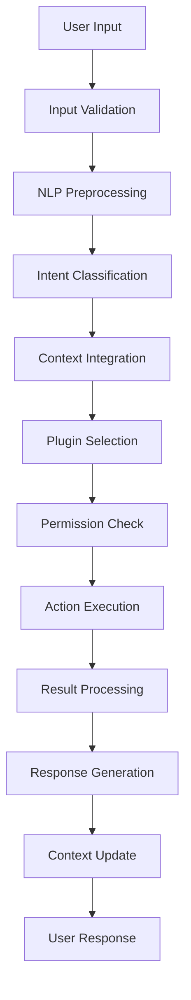

# AI Integration Architecture - Technical Deep Dive

## Table of Contents
1. [Architecture Overview](#architecture-overview)
2. [Core Components](#core-components)
3. [AI Processing Pipeline](#ai-processing-pipeline)
4. [System Integration Points](#system-integration-points)
5. [Plugin Architecture](#plugin-architecture)
6. [Data Flow and Communication](#data-flow-and-communication)
7. [Security and Privacy](#security-and-privacy)
8. [Performance Optimization](#performance-optimization)
9. [Implementation Strategy](#implementation-strategy)

---

## Architecture Overview

AstrOS implements a layered architecture that integrates AI capabilities seamlessly with the Ubuntu operating system while maintaining modularity, security, and performance.

### High-Level Architecture
```
┌─────────────────────────────────────────────────────────┐
│                  User Interface Layer                   │
│  ┌─────────────┐ ┌─────────────┐ ┌─────────────────────┐ │
│  │ Voice Input │ │ Text Input  │ │ GNOME Shell Ext    │ │
│  └─────────────┘ └─────────────┘ └─────────────────────┘ │
└─────────────────────────────────────────────────────────┘
                           │
┌─────────────────────────────────────────────────────────┐
│                  AstrOS Agent Core                      │
│  ┌─────────────┐ ┌─────────────┐ ┌─────────────────────┐ │
│  │ NLP Engine  │ │Intent Class │ │ Response Generator │ │
│  └─────────────┘ └─────────────┘ └─────────────────────┘ │
└─────────────────────────────────────────────────────────┘
                           │
┌─────────────────────────────────────────────────────────┐
│                   Plugin System                         │
│  ┌─────────────┐ ┌─────────────┐ ┌─────────────────────┐ │
│  │ File Mgmt   │ │ System Ctrl │ │ Dev Tools          │ │
│  └─────────────┘ └─────────────┘ └─────────────────────┘ │
└─────────────────────────────────────────────────────────┘
                           │
┌─────────────────────────────────────────────────────────┐
│                System Integration                       │
│  ┌─────────────┐ ┌─────────────┐ ┌─────────────────────┐ │
│  │ D-Bus APIs  │ │ System APIs │ │ Hardware Access    │ │
│  └─────────────┘ └─────────────┘ └─────────────────────┘ │
└─────────────────────────────────────────────────────────┘
                           │
┌─────────────────────────────────────────────────────────┐
│                   Ubuntu Base System                    │
│           Kernel • Drivers • Services • Apps            │
└─────────────────────────────────────────────────────────┘
```

### Design Principles
1. **Modularity**: Each component is independent and replaceable
2. **Privacy**: Local processing by default, cloud optional
3. **Performance**: Async processing with efficient resource usage
4. **Security**: Sandboxed plugins with permission model
5. **Extensibility**: Plugin architecture for community contributions

---

## Core Components

### 1. AstrOS Agent Core
The central orchestrator that manages all AI operations.

```python
# astros/core/agent.py
class AstrOSAgent:
    """
    Main agent class that coordinates all AI operations
    """
    def __init__(self, config_path: str = "/etc/astros/config.yaml"):
        self.config = Config.load(config_path)
        self.nlp_engine = NLPEngine(self.config.nlp)
        self.intent_classifier = IntentClassifier(self.config.ai)
        self.plugin_manager = PluginManager(self.config.plugins)
        self.system_interface = SystemInterface()
        self.context_manager = ContextManager()
        
    async def process_request(self, user_input: str, context: dict = None) -> Response:
        """
        Main processing pipeline for user requests
        """
        # 1. Preprocess input
        processed_input = await self.nlp_engine.preprocess(user_input)
        
        # 2. Classify intent
        intent = await self.intent_classifier.classify(
            processed_input, 
            context=context or self.context_manager.get_current_context()
        )
        
        # 3. Route to appropriate plugin
        plugin = self.plugin_manager.get_plugin(intent.domain)
        if not plugin:
            return Response.error(f"No plugin found for domain: {intent.domain}")
            
        # 4. Execute action
        result = await plugin.execute(intent)
        
        # 5. Generate natural language response
        response = await self.nlp_engine.generate_response(result, intent)
        
        # 6. Update context
        self.context_manager.update_context(intent, result)
        
        return response
```

### 2. Natural Language Processing Engine
Handles all text processing, understanding, and generation.

```python
# astros/core/nlp.py
class NLPEngine:
    """
    Natural language processing engine for AstrOS
    """
    def __init__(self, config: NLPConfig):
        self.config = config
        self.tokenizer = self._load_tokenizer()
        self.intent_model = self._load_intent_model()
        self.response_generator = self._load_response_generator()
        
    async def preprocess(self, text: str) -> ProcessedInput:
        """
        Preprocess user input for intent classification
        """
        # Tokenization
        tokens = self.tokenizer.tokenize(text.lower().strip())
        
        # Named Entity Recognition
        entities = await self._extract_entities(text)
        
        # Sentiment analysis
        sentiment = await self._analyze_sentiment(text)
        
        return ProcessedInput(
            original_text=text,
            tokens=tokens,
            entities=entities,
            sentiment=sentiment
        )
    
    async def _extract_entities(self, text: str) -> List[Entity]:
        """
        Extract named entities from text
        """
        # Use spaCy or Transformers for NER
        import spacy
        nlp = spacy.load("en_core_web_sm")
        doc = nlp(text)
        
        entities = []
        for ent in doc.ents:
            entities.append(Entity(
                text=ent.text,
                label=ent.label_,
                start=ent.start_char,
                end=ent.end_char
            ))
        
        return entities
```

### 3. Intent Classification System
Determines what the user wants to accomplish.

```python
# astros/core/intent.py
class IntentClassifier:
    """
    Classifies user intents from natural language input
    """
    def __init__(self, config: AIConfig):
        self.config = config
        self.model = self._load_model()
        self.intent_mapping = self._load_intent_mapping()
        
    async def classify(self, processed_input: ProcessedInput, context: dict = None) -> Intent:
        """
        Classify user intent from processed input
        """
        # Extract features
        features = self._extract_features(processed_input, context)
        
        # Run inference
        if self.config.use_local_model:
            prediction = await self._classify_local(features)
        else:
            prediction = await self._classify_remote(features)
        
        # Parse results
        intent = Intent(
            domain=prediction.domain,
            action=prediction.action,
            entities=processed_input.entities,
            confidence=prediction.confidence,
            parameters=self._extract_parameters(processed_input, prediction)
        )
        
        return intent
    
    def _extract_features(self, processed_input: ProcessedInput, context: dict) -> Features:
        """
        Extract features for intent classification
        """
        return Features(
            tokens=processed_input.tokens,
            entities=processed_input.entities,
            sentiment=processed_input.sentiment,
            context_features=self._extract_context_features(context),
            temporal_features=self._extract_temporal_features(),
            user_profile=self._get_user_profile()
        )
```

### 4. Plugin Management System
Manages the lifecycle and execution of plugins.

```python
# astros/core/plugins.py
class PluginManager:
    """
    Manages AstrOS plugins and their lifecycle
    """
    def __init__(self, config: PluginConfig):
        self.config = config
        self.plugins: Dict[str, BasePlugin] = {}
        self.plugin_permissions: Dict[str, List[str]] = {}
        
    async def initialize(self):
        """
        Initialize all enabled plugins
        """
        for plugin_name in self.config.enabled_plugins:
            try:
                plugin = await self._load_plugin(plugin_name)
                await plugin.initialize()
                self.plugins[plugin_name] = plugin
                self.plugin_permissions[plugin_name] = plugin.required_permissions
            except Exception as e:
                logger.error(f"Failed to load plugin {plugin_name}: {e}")
    
    def get_plugin(self, domain: str) -> Optional[BasePlugin]:
        """
        Get plugin responsible for handling a domain
        """
        for plugin_name, plugin in self.plugins.items():
            if domain in plugin.handled_domains:
                return plugin
        return None
    
    async def _load_plugin(self, plugin_name: str) -> BasePlugin:
        """
        Dynamically load a plugin
        """
        # Import plugin module
        module = importlib.import_module(f"astros.plugins.{plugin_name}")
        plugin_class = getattr(module, f"{plugin_name.title()}Plugin")
        
        # Create plugin instance
        plugin = plugin_class()
        
        # Validate permissions
        if not self._validate_permissions(plugin.required_permissions):
            raise PermissionError(f"Plugin {plugin_name} requires unauthorized permissions")
        
        return plugin
```

---

## AI Processing Pipeline

### Request Processing Flow


### Detailed Pipeline Implementation
```python
# astros/core/pipeline.py
class ProcessingPipeline:
    """
    AI processing pipeline for AstrOS requests
    """
    
    async def process(self, user_input: str, user_context: UserContext) -> ProcessingResult:
        """
        Main processing pipeline
        """
        pipeline_context = PipelineContext(
            user_input=user_input,
            user_context=user_context,
            timestamp=datetime.now(),
            session_id=user_context.session_id
        )
        
        try:
            # Stage 1: Input Validation and Sanitization
            validated_input = await self._validate_input(user_input)
            
            # Stage 2: Natural Language Processing
            nlp_result = await self._process_nlp(validated_input, pipeline_context)
            
            # Stage 3: Intent Classification
            intent = await self._classify_intent(nlp_result, pipeline_context)
            
            # Stage 4: Context Integration
            enhanced_intent = await self._integrate_context(intent, pipeline_context)
            
            # Stage 5: Plugin Execution
            execution_result = await self._execute_plugin(enhanced_intent, pipeline_context)
            
            # Stage 6: Response Generation
            response = await self._generate_response(execution_result, pipeline_context)
            
            # Stage 7: Context Update
            await self._update_context(response, pipeline_context)
            
            return ProcessingResult.success(response)
            
        except Exception as e:
            logger.error(f"Pipeline error: {e}")
            return ProcessingResult.error(str(e))
    
    async def _validate_input(self, user_input: str) -> str:
        """
        Validate and sanitize user input
        """
        # Input length validation
        if len(user_input) > MAX_INPUT_LENGTH:
            raise ValidationError("Input too long")
        
        # Content filtering
        if self._contains_harmful_content(user_input):
            raise ValidationError("Harmful content detected")
        
        # XSS/injection prevention
        sanitized = html.escape(user_input.strip())
        
        return sanitized
```

### Local vs Cloud Processing
```python
# astros/core/processing.py
class ProcessingStrategy:
    """
    Handles local vs cloud processing decisions
    """
    
    def __init__(self, config: ProcessingConfig):
        self.config = config
        self.local_capabilities = self._assess_local_capabilities()
        
    async def should_process_locally(self, intent: Intent) -> bool:
        """
        Determine if request should be processed locally
        """
        factors = {
            'privacy_sensitivity': self._assess_privacy_sensitivity(intent),
            'computational_complexity': self._assess_complexity(intent),
            'local_model_availability': self._check_local_models(intent),
            'network_availability': self._check_network(),
            'user_preference': self.config.prefer_local_processing
        }
        
        # Privacy-sensitive data always stays local
        if factors['privacy_sensitivity'] > 0.7:
            return True
        
        # Complex tasks might need cloud processing
        if factors['computational_complexity'] > 0.8 and not factors['local_model_availability']:
            return False
        
        # Respect user preference when possible
        return factors['user_preference']
```

---

## System Integration Points

### D-Bus Integration
```python
# astros/system/dbus_interface.py
class AstrOSDBusService:
    """
    D-Bus service for system integration
    """
    
    def __init__(self):
        self.bus = pydbus.SystemBus()
        self.service = self.bus.publish(
            "org.astros.Agent",
            AstrOSAgent()
        )
    
    @dbus.service.method("org.astros.Agent", in_signature='s', out_signature='s')
    def ProcessCommand(self, command: str) -> str:
        """
        Process command via D-Bus
        """
        result = await self.agent.process_request(command)
        return json.dumps(result.to_dict())
    
    @dbus.service.signal("org.astros.Agent", signature='s')
    def CommandProcessed(self, result: str):
        """
        Signal when command is processed
        """
        pass
```

### Systemd Integration
```ini
# /etc/systemd/system/astros-agent.service
[Unit]
Description=AstrOS AI Agent
Documentation=https://docs.astros.org
After=network-online.target sound.target
Wants=network-online.target

[Service]
Type=notify
User=astros
Group=astros
WorkingDirectory=/opt/astros
Environment=PYTHONPATH=/opt/astros
ExecStart=/usr/bin/python3 -m astros.agent
ExecReload=/bin/kill -USR1 $MAINPID
Restart=always
RestartSec=10
TimeoutStartSec=60
TimeoutStopSec=30

# Security settings
NoNewPrivileges=yes
PrivateTmp=yes
ProtectSystem=strict
ProtectHome=yes
ReadWritePaths=/var/lib/astros /var/log/astros

[Install]
WantedBy=multi-user.target
```

### GNOME Shell Integration
```javascript
// extensions/astros@astros.org/extension.js
const { Gio, GObject, St, Clutter } = imports.gi;
const Main = imports.ui.main;
const PanelMenu = imports.ui.panelMenu;

var AstrOSExtension = class AstrOSExtension {
    constructor() {
        this._indicator = null;
        this._proxy = null;
    }
    
    enable() {
        // Create indicator
        this._indicator = new PanelMenu.Button(0.0, 'AstrOS', false);
        
        // Add icon
        let icon = new St.Icon({
            icon_name: 'microphone-sensitivity-high-symbolic',
            style_class: 'system-status-icon'
        });
        this._indicator.add_child(icon);
        
        // Connect to AstrOS agent
        this._proxy = new Gio.DBusProxy.makeProxyWrapper(`
            <interface name="org.astros.Agent">
                <method name="ProcessCommand">
                    <arg type="s" direction="in" name="command"/>
                    <arg type="s" direction="out" name="result"/>
                </method>
                <signal name="CommandProcessed">
                    <arg type="s" name="result"/>
                </signal>
            </interface>
        `);
        
        // Add to panel
        Main.panel.addToStatusArea('astros', this._indicator);
        
        // Set up keyboard shortcut
        Main.wm.addKeybinding(
            'astros-voice-command',
            this._settings,
            Meta.KeyBindingFlags.NONE,
            Shell.ActionMode.ALL,
            this._onVoiceCommand.bind(this)
        );
    }
    
    _onVoiceCommand() {
        // Trigger voice input
        this._proxy.ProcessCommandRemote('__voice_input__');
    }
};
```

---

## Plugin Architecture

### Base Plugin Interface
```python
# astros/plugins/base.py
class BasePlugin(ABC):
    """
    Base class for all AstrOS plugins
    """
    
    # Plugin metadata
    name: str = ""
    version: str = "1.0.0"
    description: str = ""
    author: str = ""
    
    # Capabilities
    handled_domains: List[str] = []
    required_permissions: List[str] = []
    supported_intents: List[str] = []
    
    def __init__(self):
        self.config = None
        self.logger = logging.getLogger(f"astros.plugins.{self.name}")
        self.system_api = None
        
    @abstractmethod
    async def initialize(self) -> None:
        """Initialize the plugin"""
        pass
    
    @abstractmethod
    async def execute(self, intent: Intent) -> ExecutionResult:
        """Execute an intent"""
        pass
    
    @abstractmethod
    async def shutdown(self) -> None:
        """Cleanup plugin resources"""
        pass
    
    async def validate_permissions(self, required: List[str]) -> bool:
        """Validate plugin has required permissions"""
        return all(perm in self.required_permissions for perm in required)
```

### Example Plugin Implementation
```python
# astros/plugins/file_management.py
class FileManagementPlugin(BasePlugin):
    """
    Plugin for file system operations
    """
    
    name = "file_management"
    version = "1.0.0"
    description = "Natural language file system operations"
    author = "AstrOS Team"
    
    handled_domains = ["file", "filesystem", "directory"]
    required_permissions = ["file_system_read", "file_system_write"]
    supported_intents = [
        "file.create",
        "file.delete", 
        "file.move",
        "file.copy",
        "file.search",
        "directory.create",
        "directory.list"
    ]
    
    async def initialize(self) -> None:
        """Initialize file management plugin"""
        self.file_api = FileSystemAPI(self.system_api)
        self.search_index = SearchIndex()
        await self.search_index.build_initial_index()
    
    async def execute(self, intent: Intent) -> ExecutionResult:
        """Execute file management intent"""
        try:
            if intent.action == "file.search":
                return await self._search_files(intent)
            elif intent.action == "file.create":
                return await self._create_file(intent)
            elif intent.action == "file.move":
                return await self._move_file(intent)
            elif intent.action == "directory.list":
                return await self._list_directory(intent)
            else:
                return ExecutionResult.error(f"Unsupported action: {intent.action}")
                
        except PermissionError as e:
            return ExecutionResult.error(f"Permission denied: {e}")
        except Exception as e:
            self.logger.error(f"Execution error: {e}")
            return ExecutionResult.error(f"Failed to execute: {e}")
    
    async def _search_files(self, intent: Intent) -> ExecutionResult:
        """Search for files based on natural language query"""
        query = intent.parameters.get('query', '')
        file_type = intent.parameters.get('file_type', 'any')
        location = intent.parameters.get('location', '~')
        
        # Use semantic search for better results
        results = await self.search_index.semantic_search(
            query=query,
            file_type=file_type,
            location=os.path.expanduser(location),
            max_results=20
        )
        
        return ExecutionResult.success({
            'files': results,
            'count': len(results),
            'query': query
        })
```

---

## Data Flow and Communication

### Internal Communication
```python
# astros/core/messaging.py
class MessageBus:
    """
    Internal message bus for component communication
    """
    
    def __init__(self):
        self.subscribers: Dict[str, List[Callable]] = {}
        self.message_queue = asyncio.Queue()
        self.processing_task = None
    
    async def start(self):
        """Start message processing"""
        self.processing_task = asyncio.create_task(self._process_messages())
    
    async def publish(self, topic: str, message: dict):
        """Publish message to topic"""
        await self.message_queue.put(Message(topic, message, datetime.now()))
    
    def subscribe(self, topic: str, callback: Callable):
        """Subscribe to topic"""
        if topic not in self.subscribers:
            self.subscribers[topic] = []
        self.subscribers[topic].append(callback)
    
    async def _process_messages(self):
        """Process messages from queue"""
        while True:
            try:
                message = await self.message_queue.get()
                if message.topic in self.subscribers:
                    for callback in self.subscribers[message.topic]:
                        try:
                            await callback(message)
                        except Exception as e:
                            logger.error(f"Message handler error: {e}")
            except Exception as e:
                logger.error(f"Message processing error: {e}")
```

### External API Integration
```python
# astros/api/external.py
class ExternalAPIManager:
    """
    Manages external API integrations
    """
    
    def __init__(self, config: APIConfig):
        self.config = config
        self.clients = {}
        self.rate_limiters = {}
        
    async def call_api(self, provider: str, endpoint: str, **kwargs) -> APIResponse:
        """
        Make API call with rate limiting and error handling
        """
        if provider not in self.clients:
            raise ValueError(f"Unknown API provider: {provider}")
        
        # Rate limiting
        await self._wait_for_rate_limit(provider)
        
        # Make request with retry logic
        for attempt in range(3):
            try:
                client = self.clients[provider]
                response = await client.request(endpoint, **kwargs)
                return APIResponse.success(response)
            except Exception as e:
                if attempt == 2:  # Last attempt
                    return APIResponse.error(str(e))
                await asyncio.sleep(2 ** attempt)  # Exponential backoff
```

---

## Security and Privacy

### Permission System
```python
# astros/security/permissions.py
class PermissionManager:
    """
    Manages plugin permissions and access control
    """
    
    AVAILABLE_PERMISSIONS = {
        'file_system_read': 'Read files and directories',
        'file_system_write': 'Create, modify, delete files',
        'network_access': 'Access network and internet',
        'system_commands': 'Execute system commands',
        'audio_input': 'Access microphone',
        'audio_output': 'Control speakers',
        'camera_access': 'Access camera',
        'location_access': 'Access location services',
        'contacts_access': 'Access contact information',
        'calendar_access': 'Access calendar data'
    }
    
    def __init__(self):
        self.plugin_permissions = {}
        self.user_grants = {}
    
    def request_permission(self, plugin_name: str, permission: str) -> bool:
        """
        Request permission for plugin
        """
        if permission not in self.AVAILABLE_PERMISSIONS:
            raise ValueError(f"Unknown permission: {permission}")
        
        # Check if already granted
        key = f"{plugin_name}:{permission}"
        if key in self.user_grants:
            return self.user_grants[key]
        
        # Prompt user for permission
        granted = self._prompt_user_permission(plugin_name, permission)
        self.user_grants[key] = granted
        
        return granted
    
    def _prompt_user_permission(self, plugin_name: str, permission: str) -> bool:
        """
        Prompt user for permission grant
        """
        # This would show a GUI dialog or notification
        # For now, return based on security policy
        return self._evaluate_security_policy(plugin_name, permission)
```

### Data Privacy
```python
# astros/privacy/data_manager.py
class PrivacyDataManager:
    """
    Manages user data privacy and retention
    """
    
    def __init__(self, config: PrivacyConfig):
        self.config = config
        self.encryption_key = self._load_encryption_key()
        
    async def store_data(self, data: dict, retention_policy: str = 'default') -> str:
        """
        Store data with encryption and retention policy
        """
        # Encrypt sensitive data
        encrypted_data = self._encrypt_data(data)
        
        # Add metadata
        metadata = {
            'created_at': datetime.now().isoformat(),
            'retention_policy': retention_policy,
            'expires_at': self._calculate_expiry(retention_policy)
        }
        
        # Store in database
        data_id = await self._store_encrypted(encrypted_data, metadata)
        
        return data_id
    
    async def cleanup_expired_data(self):
        """
        Remove expired data based on retention policies
        """
        expired_items = await self._find_expired_data()
        for item_id in expired_items:
            await self._secure_delete(item_id)
            logger.info(f"Removed expired data: {item_id}")
```

---

## Performance Optimization

### Caching Strategy
```python
# astros/performance/cache.py
class IntelligentCache:
    """
    Multi-level caching system for AstrOS
    """
    
    def __init__(self, config: CacheConfig):
        self.config = config
        self.memory_cache = {}
        self.disk_cache = DiskCache(config.disk_cache_path)
        self.cache_stats = CacheStats()
    
    async def get(self, key: str, generator: Callable = None) -> Any:
        """
        Get value from cache with fallback to generator
        """
        # Level 1: Memory cache
        if key in self.memory_cache:
            self.cache_stats.memory_hits += 1
            return self.memory_cache[key]
        
        # Level 2: Disk cache
        disk_value = await self.disk_cache.get(key)
        if disk_value is not None:
            self.cache_stats.disk_hits += 1
            # Promote to memory cache
            self.memory_cache[key] = disk_value
            return disk_value
        
        # Level 3: Generate new value
        if generator:
            self.cache_stats.misses += 1
            value = await generator()
            await self.set(key, value)
            return value
        
        return None
```

### Resource Management
```python
# astros/performance/resources.py
class ResourceManager:
    """
    Manages system resources and performance
    """
    
    def __init__(self):
        self.cpu_usage = CPUMonitor()
        self.memory_usage = MemoryMonitor()
        self.gpu_usage = GPUMonitor()
        
    async def should_throttle(self) -> bool:
        """
        Determine if processing should be throttled
        """
        cpu_high = self.cpu_usage.get_average() > 80
        memory_high = self.memory_usage.get_usage_percent() > 85
        temperature_high = await self._check_thermal_throttling()
        
        return cpu_high or memory_high or temperature_high
    
    async def optimize_for_battery(self) -> None:
        """
        Optimize performance for battery life
        """
        if self._is_on_battery():
            # Reduce AI model precision
            await self._switch_to_lightweight_models()
            
            # Increase cache retention
            await self._extend_cache_lifetime()
            
            # Reduce background processing
            await self._throttle_background_tasks()
```

---

## Implementation Strategy

### Phase 1: Core Foundation (Weeks 1-4)
```python
# Development milestones for Phase 1

# Week 1: Basic Agent Structure
class MinimalAgent:
    def __init__(self):
        self.logger = logging.getLogger("astros.agent")
    
    async def process_simple_command(self, command: str) -> str:
        # Basic text processing without AI
        if "hello" in command.lower():
            return "Hello! AstrOS is starting up."
        return "Command received: " + command

# Week 2: Add Basic NLP
# - Integrate spaCy for basic text processing
# - Implement simple intent detection
# - Add basic response templates

# Week 3: Plugin System Foundation
# - Create plugin loading mechanism
# - Implement permission system basics
# - Add file management plugin stub

# Week 4: System Integration
# - Add D-Bus service
# - Create systemd service
# - Basic GNOME Shell extension
```

### Phase 2: AI Integration (Weeks 5-8)
```python
# Week 5: Local AI Models
# - Integrate Transformers library
# - Add local intent classification
# - Implement basic response generation

# Week 6: Context Management
# - Add conversation context
# - Implement user profiling
# - Add memory persistence

# Week 7: Advanced NLP
# - Named entity recognition
# - Sentiment analysis
# - Multi-turn conversations

# Week 8: Performance Optimization
# - Add caching layer
# - Implement resource management
# - Optimize model loading
```

### Phase 3: Plugin Ecosystem (Weeks 9-12)
```python
# Week 9: Core Plugins
# - File management plugin
# - System control plugin
# - Basic development tools

# Week 10: Plugin Infrastructure
# - Plugin marketplace design
# - Update mechanism
# - Security validation

# Week 11: Advanced Features
# - Voice input/output
# - Multi-modal processing
# - External API integration

# Week 12: Testing and Polish
# - Comprehensive testing
# - Performance benchmarking
# - Documentation completion
```

### Development Environment Setup
```bash
# Create development environment
python3 -m venv astros-dev
source astros-dev/bin/activate

# Install development dependencies
pip install -r requirements-dev.txt

# Set up pre-commit hooks
pre-commit install

# Create development database
python3 -m astros.db.setup --dev

# Start development server
python3 -m astros.agent --dev-mode
```

---

## Next Steps

### Immediate Actions
1. **Set up development environment**
2. **Implement minimal agent core**
3. **Create basic plugin system**
4. **Add simple NLP processing**
5. **Integrate with Ubuntu system**

### Success Metrics
- Agent responds to basic text commands
- Plugin system loads and executes simple tasks
- System integration works (D-Bus, systemd)
- Performance meets minimum requirements
- Security model prevents unauthorized access

The key is to start simple and build incrementally, always maintaining a working system that demonstrates the core concept while gradually adding sophistication and capabilities.