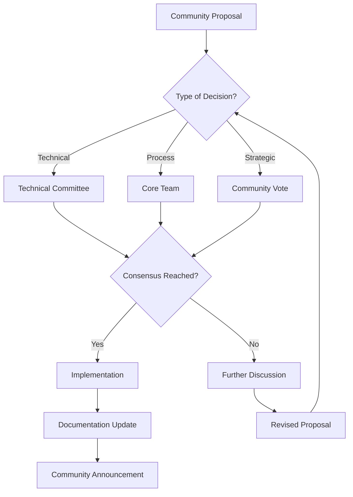

# Open Source Maintenance & Community Management Guide

## Table of Contents
1. [Open Source Strategy](#open-source-strategy)
2. [Community Building](#community-building)
3. [Governance Model](#governance-model)
4. [Release Management](#release-management)
5. [Documentation Strategy](#documentation-strategy)
6. [Legal and Licensing](#legal-and-licensing)
7. [Sustainability Planning](#sustainability-planning)
8. [Quality Assurance](#quality-assurance)
9. [Marketing and Outreach](#marketing-and-outreach)
10. [Long-term Vision](#long-term-vision)

---

## Open Source Strategy

### Core Philosophy
AstrOS embraces open source principles not just as a development model, but as a fundamental approach to building trustworthy AI systems that users can understand, modify, and control.

### Strategic Advantages
1. **Transparency**: Users can audit AI behavior and data handling
2. **Trust**: Open development builds confidence in privacy claims  
3. **Innovation**: Community contributions accelerate development
4. **Adoption**: Lower barriers to entry for enterprise users
5. **Sustainability**: Reduces single-point-of-failure risks

### Open Source Principles for AstrOS
```yaml
Transparency:
  - All core algorithms are public
  - Decision-making processes are documented
  - Development roadmap is open
  - Financial information is shared

Community First:
  - Contributors have real influence
  - User feedback drives priorities
  - Community can fork and modify freely
  - No vendor lock-in strategies

Privacy Respect:
  - Local-first architecture
  - User data never required for contribution
  - Privacy policy is clear and enforced
  - Opt-in telemetry only

Quality Standards:
  - Code review required for all changes
  - Comprehensive testing before releases
  - Security audits and vulnerability disclosure
  - Performance benchmarks maintained
```

---

## Community Building

### Community Structure
```
┌─────────────────────────────────────────────────────────┐
│                    Core Team                            │
│         (Full-time maintainers)                        │
└─────────────────────────────────────────────────────────┘
                           │
┌─────────────────────────────────────────────────────────┐
│                 Technical Committee                     │
│        (Architecture and major decisions)              │
└─────────────────────────────────────────────────────────┘
                           │
┌─────────────────────────────────────────────────────────┐
│                Plugin Maintainers                      │
│         (Community-maintained plugins)                 │
└─────────────────────────────────────────────────────────┘
                           │
┌─────────────────────────────────────────────────────────┐
│                   Contributors                          │
│     (Regular contributors with commit access)          │
└─────────────────────────────────────────────────────────┘
                           │
┌─────────────────────────────────────────────────────────┐
│                Community Members                        │
│    (Users, reporters, occasional contributors)         │
└─────────────────────────────────────────────────────────┘
```

### Community Onboarding Process
```python
# Community onboarding workflow
class CommunityOnboarding:
    """
    Systematic approach to welcome new community members
    """
    
    def new_user_journey(self):
        """
        Define the path from discovery to contribution
        """
        stages = [
            {
                'stage': 'Discovery',
                'touchpoints': ['Website', 'Documentation', 'Videos'],
                'goals': ['Understand AstrOS value', 'See working demo'],
                'duration': '1-7 days'
            },
            {
                'stage': 'First Use',
                'touchpoints': ['Download ISO', 'Installation', 'First boot'],
                'goals': ['Working system', 'Basic AI interaction'],
                'duration': '1-3 hours'
            },
            {
                'stage': 'Engagement',
                'touchpoints': ['Discord/Matrix', 'Forums', 'GitHub'],
                'goals': ['Ask questions', 'Share feedback'],
                'duration': '1-4 weeks'
            },
            {
                'stage': 'Contribution',
                'touchpoints': ['Good first issues', 'Mentorship', 'Reviews'],
                'goals': ['First PR merged', 'Regular participation'],
                'duration': '1-6 months'
            },
            {
                'stage': 'Leadership',
                'touchpoints': ['Maintainer nomination', 'Responsibilities'],
                'goals': ['Help others', 'Shape direction'],
                'duration': '6+ months'
            }
        ]
        return stages
```

### Community Platforms and Tools
```yaml
Communication Channels:
  Primary:
    - Discord: Real-time chat, voice calls, screen sharing
    - GitHub Discussions: Long-form technical discussions
    - Matrix: Open protocol alternative to Discord
  
  Secondary:
    - Reddit: r/AstrOS for broader community
    - Twitter: @AstrOSProject for announcements
    - YouTube: Tutorials and development updates
    - Mailing Lists: For formal announcements

Development Tools:
  - GitHub: Source code, issues, project management
  - GitHub Actions: CI/CD and automation
  - CodeClimate: Code quality monitoring
  - Dependabot: Dependency updates
  
Documentation:
  - GitBook/MkDocs: User documentation
  - GitHub Wiki: Developer notes
  - API Documentation: Auto-generated from code
  
Community Management:
  - Discord bots: Moderation and helpful responses
  - GitHub bots: Automated triage and labeling
  - Analytics: Community health metrics
```

### Contributor Recognition System
```python
# Recognition and rewards for contributors
class ContributorRecognition:
    """
    System to recognize and reward community contributions
    """
    
    RECOGNITION_LEVELS = {
        'first_contribution': {
            'threshold': 1,
            'rewards': ['Welcome message', 'Contributor badge'],
            'benefits': ['Listed in contributors']
        },
        'regular_contributor': {
            'threshold': 10,
            'rewards': ['AstrOS stickers', 'Discord role'],
            'benefits': ['Early access to features']
        },
        'core_contributor': {
            'threshold': 50,
            'rewards': ['AstrOS t-shirt', 'Video call with team'],
            'benefits': ['Influence on roadmap']
        },
        'maintainer': {
            'threshold': 100,
            'rewards': ['Conference speaking opportunity'],
            'benefits': ['Commit access', 'Decision making']
        }
    }
    
    def calculate_contribution_score(self, contributor_id: str) -> int:
        """
        Calculate contributor score based on various activities
        """
        activities = self.get_contributor_activities(contributor_id)
        
        score = 0
        score += activities['merged_prs'] * 10
        score += activities['issues_created'] * 2
        score += activities['issues_triaged'] * 3
        score += activities['documentation_updates'] * 5
        score += activities['community_help'] * 1
        score += activities['bug_reports'] * 3
        score += activities['security_reports'] * 20
        
        return score
```

---

## Governance Model

### Decision Making Process


### Governance Structure
```python
# Governance roles and responsibilities
class GovernanceModel:
    """
    Define roles, responsibilities, and decision-making processes
    """
    
    ROLES = {
        'project_lead': {
            'count': 1,
            'term': 'Indefinite',
            'responsibilities': [
                'Final decision on strategic direction',
                'Represent project externally',
                'Resolve governance conflicts',
                'Appoint technical committee'
            ],
            'requirements': ['Project founder or community election']
        },
        
        'technical_committee': {
            'count': 5,
            'term': '2 years',
            'responsibilities': [
                'Architecture decisions',
                'Technical standards',
                'Security policy',
                'Plugin approval process'
            ],
            'requirements': ['Technical expertise', 'Community nomination']
        },
        
        'core_maintainers': {
            'count': 'Variable',
            'term': 'Indefinite',
            'responsibilities': [
                'Code review and merging',
                'Release management',
                'Issue triage',
                'Community support'
            ],
            'requirements': ['Consistent contributions', 'Peer nomination']
        },
        
        'plugin_maintainers': {
            'count': 'Variable',
            'term': 'Per plugin',
            'responsibilities': [
                'Plugin development',
                'User support for plugin',
                'Security updates',
                'Documentation maintenance'
            ],
            'requirements': ['Plugin development', 'Community approval']
        }
    }
```

### Conflict Resolution Process
```yaml
Conflict Resolution Steps:
  1. Direct Communication:
     - Encourage private discussion first
     - Provide mediation resources
     - Set 48-hour response expectation
  
  2. Community Mediation:
     - Escalate to neutral community members
     - Public discussion in appropriate forum
     - Seek win-win solutions
  
  3. Governance Review:
     - Technical Committee for technical disputes
     - Core Team for process disputes
     - Community vote for major conflicts
  
  4. Final Resolution:
     - Project Lead makes final decision
     - Document reasoning publicly
     - Implement with clear timeline

Code of Conduct Enforcement:
  1. Warning: Private message explaining issue
  2. Temporary Restriction: Limited participation (1-7 days)
  3. Temporary Ban: No participation (1-30 days)  
  4. Permanent Ban: Indefinite exclusion
```

---

## Release Management

### Release Cycle Strategy
```python
# Release management system
class ReleaseManager:
    """
    Manages AstrOS release lifecycle
    """
    
    RELEASE_TYPES = {
        'major': {
            'frequency': '6 months',
            'breaking_changes': True,
            'new_features': True,
            'version_bump': 'x.0.0',
            'support_period': '18 months'
        },
        'minor': {
            'frequency': '6 weeks',
            'breaking_changes': False,
            'new_features': True,
            'version_bump': '0.x.0',
            'support_period': '6 months'
        },
        'patch': {
            'frequency': 'As needed',
            'breaking_changes': False,
            'new_features': False,
            'version_bump': '0.0.x',
            'support_period': 'Until next minor'
        },
        'security': {
            'frequency': 'Immediate',
            'breaking_changes': False,
            'new_features': False,
            'version_bump': '0.0.x',
            'support_period': 'Same as base version'
        }
    }
    
    def create_release_plan(self, version: str, type: str) -> ReleasePlan:
        """
        Create comprehensive release plan
        """
        plan = ReleasePlan(version=version, type=type)
        
        # Development phase (4-5 weeks for minor, 20+ weeks for major)
        plan.add_phase('development', {
            'duration': self._calculate_dev_duration(type),
            'activities': [
                'Feature development',
                'Code review',
                'Unit testing',
                'Documentation updates'
            ]
        })
        
        # Feature freeze (1 week)
        plan.add_phase('feature_freeze', {
            'duration': 1,
            'activities': [
                'No new features',
                'Bug fixes only',
                'Translation updates',
                'Beta testing preparation'
            ]
        })
        
        # Beta testing (2 weeks)
        plan.add_phase('beta', {
            'duration': 2,
            'activities': [
                'Beta release to community',
                'Automated testing',
                'Manual testing',
                'Performance benchmarking',
                'Security scanning'
            ]
        })
        
        # Release candidate (1 week)
        plan.add_phase('release_candidate', {
            'duration': 1,
            'activities': [
                'RC build and testing',
                'Final documentation review',
                'Release notes preparation',
                'Infrastructure preparation'
            ]
        })
        
        # Release (1 day)
        plan.add_phase('release', {
            'duration': 0.1,
            'activities': [
                'Final build and signing',
                'Upload to mirrors',
                'Update website',
                'Social media announcement',
                'Community notification'
            ]
        })
        
        return plan
```

### Quality Gates for Releases
```yaml
Pre-Release Quality Gates:
  Automated Testing:
    - Unit tests: 90%+ pass rate
    - Integration tests: 95%+ pass rate
    - Performance tests: No regression > 10%
    - Security scans: No high/critical vulnerabilities
    
  Manual Testing:
    - Installation testing on supported platforms
    - Core functionality verification
    - Plugin compatibility testing
    - Accessibility testing
    - Documentation accuracy review
    
  Community Validation:
    - Beta testing feedback addressed
    - Critical issues resolved
    - Community approval (informal poll)
    - Maintainer sign-off required

Post-Release Monitoring:
  First 24 Hours:
    - Monitor crash reports
    - Track download metrics
    - Watch community feedback
    - Prepare hotfix if needed
    
  First Week:
    - Performance monitoring
    - User experience feedback
    - Plugin compatibility reports
    - Security vulnerability reports
    
  First Month:
    - Adoption metrics
    - Feature usage statistics
    - Community satisfaction survey
    - Plan next release priorities
```

---

## Documentation Strategy

### Documentation Architecture
```
Documentation Ecosystem:
├── User Documentation
│   ├── Getting Started Guide
│   ├── Installation Instructions  
│   ├── User Manual
│   ├── FAQ and Troubleshooting
│   └── Video Tutorials
├── Developer Documentation
│   ├── API Reference
│   ├── Plugin Development Guide
│   ├── Contributing Guidelines
│   ├── Architecture Overview
│   └── Code Examples
├── Community Documentation
│   ├── Governance Model
│   ├── Code of Conduct
│   ├── Communication Guidelines
│   └── Event Planning
└── Administrative Documentation
    ├── Release Process
    ├── Security Procedures
    ├── Legal Information
    └── Brand Guidelines
```

### Documentation Quality Standards
```python
# Documentation quality assurance
class DocumentationQA:
    """
    Ensure documentation meets quality standards
    """
    
    QUALITY_CRITERIA = {
        'accuracy': {
            'description': 'Information is correct and up-to-date',
            'validation': ['Technical review', 'User testing'],
            'metrics': ['Error reports', 'Correction frequency']
        },
        'completeness': {
            'description': 'All necessary information is included',
            'validation': ['Coverage analysis', 'User feedback'],
            'metrics': ['Topic coverage', 'Help request frequency']
        },
        'clarity': {
            'description': 'Information is easy to understand',
            'validation': ['Readability analysis', 'User comprehension'],
            'metrics': ['Reading level', 'Confusion reports']
        },
        'accessibility': {
            'description': 'Usable by people with disabilities',
            'validation': ['Accessibility audit', 'Screen reader testing'],
            'metrics': ['WCAG compliance', 'Accessibility feedback']
        },
        'maintainability': {
            'description': 'Easy to update and maintain',
            'validation': ['Contributor feedback', 'Update frequency'],
            'metrics': ['Update time', 'Contributor participation']
        }
    }
    
    def assess_documentation_quality(self, doc_path: str) -> QualityReport:
        """
        Assess documentation against quality criteria
        """
        report = QualityReport(doc_path)
        
        # Automated checks
        report.readability_score = self.check_readability(doc_path)
        report.link_validity = self.check_links(doc_path)
        report.code_examples = self.validate_code_examples(doc_path)
        report.accessibility_score = self.check_accessibility(doc_path)
        
        # Manual review checklist
        report.manual_checklist = {
            'technical_accuracy': None,  # Requires expert review
            'user_comprehension': None,  # Requires user testing
            'completeness': None,       # Requires topic analysis
            'visual_design': None       # Requires design review
        }
        
        return report
```

---

## Legal and Licensing

### Licensing Strategy
```yaml
Core Licensing Approach:
  Primary License: Apache License 2.0
  Rationale:
    - Business-friendly and widely accepted
    - Allows commercial use and modification
    - Includes patent protection clauses
    - Compatible with most other licenses
    
  Component Licensing:
    Core System: Apache 2.0 (required)
    Official Plugins: Apache 2.0 (recommended)
    Third-party Plugins: Any OSI-approved license
    Documentation: Creative Commons CC-BY-4.0
    Website Content: Creative Commons CC-BY-SA-4.0
    
  License Compatibility Matrix:
    ✅ MIT, BSD, ISC (compatible)
    ✅ Apache 2.0 (same license)
    ✅ LGPL 2.1+ (dynamic linking)
    ⚠️ GPL 2.0 (complex compatibility)
    ⚠️ GPL 3.0 (requires careful review)
    ❌ AGPL (not compatible)
    ❌ Proprietary (not allowed in core)
```

### Intellectual Property Management
```python
# IP and legal compliance management
class IPManager:
    """
    Manage intellectual property and legal compliance
    """
    
    def validate_contribution(self, contribution: Contribution) -> ValidationResult:
        """
        Validate contribution for legal compliance
        """
        checks = []
        
        # License compatibility
        if contribution.includes_third_party_code:
            license_check = self.check_license_compatibility(
                contribution.third_party_licenses
            )
            checks.append(license_check)
        
        # Copyright ownership
        copyright_check = self.verify_copyright_ownership(contribution)
        checks.append(copyright_check)
        
        # Patent implications
        if self.may_involve_patents(contribution):
            patent_check = self.assess_patent_risk(contribution)
            checks.append(patent_check)
        
        # Export control
        if self.involves_cryptography(contribution):
            export_check = self.check_export_compliance(contribution)
            checks.append(export_check)
        
        return ValidationResult(checks)
    
    CONTRIBUTOR_AGREEMENT = {
        'type': 'Developer Certificate of Origin (DCO)',
        'requirement': 'Signed-off-by line in commit message',
        'legal_effect': 'Certifies contributor has right to submit',
        'enforcement': 'Automated check on all commits'
    }
```

### Trademark and Brand Protection
```yaml
Trademark Strategy:
  Protected Marks:
    - "AstrOS" (word mark)
    - AstrOS logo (design mark)
    - "AI-Integrated Operating System" (tagline)
    
  Usage Guidelines:
    Permitted Uses:
      - References in academic papers
      - News articles and reviews
      - Community discussions
      - Educational materials
      
    Restricted Uses:
      - Commercial product names
      - Domain names for commercial use
      - Modified versions without clear distinction
      - Endorsement implications
      
  Enforcement Policy:
    - Monitor for trademark infringement
    - Send friendly notices for minor issues
    - Legal action for serious violations
    - Regular trademark maintenance filings
```

---

## Sustainability Planning

### Financial Sustainability Model
```python
# Sustainability and funding strategy
class SustainabilityModel:
    """
    Plan for long-term project sustainability
    """
    
    REVENUE_STREAMS = {
        'consulting_services': {
            'description': 'Implementation and customization services',
            'target_market': 'Enterprise customers',
            'projected_revenue': 'High',
            'resource_requirements': 'Skilled consultants'
        },
        'commercial_support': {
            'description': 'Premium support subscriptions',
            'target_market': 'Business users',
            'projected_revenue': 'Medium',
            'resource_requirements': 'Support team'
        },
        'hosted_services': {
            'description': 'Cloud-based AstrOS instances',
            'target_market': 'Individual and small business',
            'projected_revenue': 'Medium',
            'resource_requirements': 'Infrastructure and ops'
        },
        'training_certification': {
            'description': 'Official AstrOS training programs',
            'target_market': 'Developers and IT professionals',
            'projected_revenue': 'Low-Medium',
            'resource_requirements': 'Curriculum development'
        },
        'donations_sponsorships': {
            'description': 'Community and corporate donations',
            'target_market': 'Community and corporate sponsors',
            'projected_revenue': 'Variable',
            'resource_requirements': 'Fundraising efforts'
        }
    }
    
    def calculate_sustainability_metrics(self) -> SustainabilityReport:
        """
        Calculate key sustainability indicators
        """
        metrics = {
            'bus_factor': self.calculate_bus_factor(),
            'contributor_diversity': self.measure_contributor_diversity(),
            'financial_runway': self.calculate_financial_runway(),
            'dependency_health': self.assess_dependency_health(),
            'community_growth': self.measure_community_growth()
        }
        
        return SustainabilityReport(metrics)
```

### Risk Management
```yaml
Identified Risks and Mitigation Strategies:
  Technical Risks:
    Dependency Vulnerabilities:
      - Mitigation: Regular security audits and updates
      - Monitoring: Automated dependency scanning
      - Response Plan: Emergency patching procedures
      
    Performance Degradation:
      - Mitigation: Continuous performance monitoring
      - Monitoring: Automated benchmarking
      - Response Plan: Performance regression fixes
      
  Community Risks:
    Maintainer Burnout:
      - Mitigation: Workload distribution and recognition
      - Monitoring: Contributor activity tracking
      - Response Plan: Leadership transition procedures
      
    Community Fragmentation:
      - Mitigation: Clear governance and communication
      - Monitoring: Community health metrics
      - Response Plan: Conflict resolution processes
      
  Business Risks:
    Funding Shortfall:
      - Mitigation: Diversified revenue streams
      - Monitoring: Financial planning and tracking
      - Response Plan: Reduced scope or emergency funding
      
    Legal Challenges:
      - Mitigation: Proper licensing and IP management
      - Monitoring: Legal landscape monitoring
      - Response Plan: Legal defense fund and procedures
```

---

## Quality Assurance

### Continuous Quality Improvement
```python
# Quality assurance framework
class QualityAssurance:
    """
    Comprehensive quality assurance for AstrOS
    """
    
    QUALITY_DIMENSIONS = {
        'code_quality': {
            'metrics': ['Cyclomatic complexity', 'Test coverage', 'Code duplication'],
            'tools': ['SonarQube', 'CodeClimate', 'pytest-cov'],
            'thresholds': {'complexity': 10, 'coverage': 80, 'duplication': 5}
        },
        'performance': {
            'metrics': ['Response time', 'Memory usage', 'CPU utilization'],
            'tools': ['Performance benchmarks', 'Memory profilers'],
            'thresholds': {'response_time': 500, 'memory': '1GB', 'cpu': 80}
        },
        'security': {
            'metrics': ['Vulnerability count', 'Security score', 'Patch time'],
            'tools': ['OWASP ZAP', 'Bandit', 'Safety'],
            'thresholds': {'vulnerabilities': 0, 'patch_time': 48}
        },
        'usability': {
            'metrics': ['Task completion rate', 'Error rate', 'User satisfaction'],
            'tools': ['User testing', 'Analytics', 'Surveys'],
            'thresholds': {'completion_rate': 85, 'error_rate': 5}
        }
    }
    
    def generate_quality_report(self) -> QualityReport:
        """
        Generate comprehensive quality report
        """
        report = QualityReport()
        
        for dimension, config in self.QUALITY_DIMENSIONS.items():
            dimension_score = self.assess_dimension(dimension, config)
            report.add_dimension_score(dimension, dimension_score)
        
        report.overall_score = self.calculate_overall_score(report)
        report.recommendations = self.generate_recommendations(report)
        
        return report
```

### Community Feedback Integration
```yaml
Feedback Collection Mechanisms:
  User Surveys:
    - Quarterly satisfaction surveys
    - Feature request collections
    - Usability studies
    - Performance feedback
    
  Community Forums:
    - GitHub Discussions for technical feedback
    - Discord for real-time community input
    - Reddit for broader user perspectives
    - Matrix for privacy-focused discussions
    
  Analytics and Telemetry:
    - Opt-in usage analytics
    - Crash reporting system
    - Performance metrics collection
    - Feature usage statistics
    
  Direct Communication:
    - Office hours with maintainers
    - User interviews and case studies
    - Conference feedback sessions
    - Beta testing programs

Feedback Processing Workflow:
  1. Collection: Gather feedback from all channels
  2. Categorization: Sort by type, priority, and component
  3. Analysis: Identify patterns and common themes
  4. Prioritization: Rank based on impact and effort
  5. Planning: Include in roadmap and sprint planning
  6. Implementation: Assign to appropriate teams
  7. Communication: Update community on progress
  8. Validation: Verify feedback has been addressed
```

---

## Marketing and Outreach

### Content Marketing Strategy
```python
# Content marketing and community outreach
class MarketingStrategy:
    """
    Manage marketing and outreach efforts
    """
    
    CONTENT_PILLARS = {
        'education': {
            'description': 'Teaching AI and OS concepts',
            'content_types': ['Tutorials', 'Documentation', 'Webinars'],
            'target_audience': 'Developers and tech enthusiasts',
            'success_metrics': ['Views', 'Engagement', 'Community growth']
        },
        'innovation': {
            'description': 'Showcasing cutting-edge features',
            'content_types': ['Demo videos', 'Blog posts', 'Presentations'],
            'target_audience': 'Tech industry and media',
            'success_metrics': ['Media coverage', 'Industry recognition']
        },
        'community': {
            'description': 'Highlighting community contributions',
            'content_types': ['Contributor spotlights', 'Case studies'],
            'target_audience': 'Potential contributors',
            'success_metrics': ['New contributors', 'Community engagement']
        },
        'transparency': {
            'description': 'Open development and decision-making',
            'content_types': ['Development logs', 'Roadmap updates'],
            'target_audience': 'Privacy-conscious users',
            'success_metrics': ['Trust indicators', 'User adoption']
        }
    }
    
    def create_content_calendar(self, quarter: str) -> ContentCalendar:
        """
        Create quarterly content calendar
        """
        calendar = ContentCalendar(quarter)
        
        # Weekly blog posts
        calendar.add_recurring('blog_post', frequency='weekly')
        
        # Monthly video tutorials
        calendar.add_recurring('tutorial_video', frequency='monthly')
        
        # Quarterly webinars
        calendar.add_recurring('webinar', frequency='quarterly')
        
        # Event-driven content
        calendar.add_events([
            'Conference presentations',
            'Release announcements',
            'Security updates',
            'Community highlights'
        ])
        
        return calendar
```

### Conference and Event Strategy
```yaml
Event Participation Strategy:
  Target Conferences:
    Tier 1 (Must Attend):
      - FOSDEM: Open source showcase
      - Linux Plumbers: Kernel and system-level
      - PyCon: Python community
      - DEF CON: Security community
      
    Tier 2 (Opportunity Dependent):
      - OSCON: Open source commercial
      - Scale: Linux and open source
      - EuroPython: European Python community
      - Black Hat: Security industry
      
    Tier 3 (Community Events):
      - Local Linux user groups
      - Python meetups
      - University tech talks
      - Hackathons and code sprints

  Event Activities:
    Speaking Opportunities:
      - Technical presentations on AI integration
      - Workshops on plugin development
      - Panel discussions on AI privacy
      - Lightning talks on specific features
      
    Community Building:
      - Booth presence with demos
      - Contributor meetups
      - Networking with potential partners
      - Recruiting new community members
      
  Success Metrics:
    - Number of new GitHub stars/forks
    - Community member signups
    - Media coverage and social mentions
    - Follow-up conversations and partnerships
```

---

## Long-term Vision

### 5-Year Strategic Plan
```python
# Long-term strategic planning
class StrategicPlan:
    """
    Define and track long-term strategic objectives
    """
    
    STRATEGIC_OBJECTIVES = {
        'year_1': {
            'primary_goals': [
                'Stable 1.0 release with core functionality',
                'Active community of 1000+ members',
                'Plugin ecosystem with 50+ plugins',
                'Enterprise pilot programs'
            ],
            'success_metrics': {
                'downloads': 100000,
                'github_stars': 5000,
                'active_contributors': 50,
                'plugin_count': 50
            }
        },
        'year_2': {
            'primary_goals': [
                'Multi-architecture support (ARM, RISC-V)',
                'Enterprise-grade security and compliance',
                'International localization',
                'Sustainable funding model'
            ],
            'success_metrics': {
                'downloads': 500000,
                'enterprise_deployments': 100,
                'supported_languages': 10,
                'revenue': 500000
            }
        },
        'year_3': {
            'primary_goals': [
                'Industry partnerships and integrations',
                'Advanced AI capabilities and models',
                'Education sector adoption',
                'Certification programs'
            ],
            'success_metrics': {
                'partnerships': 20,
                'educational_adoptions': 50,
                'certified_professionals': 1000,
                'market_recognition': 'Top 3 AI OS'
            }
        },
        'year_5': {
            'primary_goals': [
                'Mainstream desktop adoption',
                'Ecosystem of complementary products',
                'Research and academic recognition',
                'Sustainable long-term governance'
            ],
            'success_metrics': {
                'market_share': '5% of Linux desktop',
                'academic_papers': 100,
                'derivative_distributions': 10,
                'community_size': 100000
            }
        }
    }
```

### Legacy and Impact Goals
```yaml
Long-term Impact Vision:
  Technical Innovation:
    - Advance state of AI-OS integration
    - Contribute to open source AI ecosystem  
    - Influence industry standards for AI privacy
    - Pioneer new human-computer interaction models
    
  Community Impact:
    - Create sustainable open source community
    - Train next generation of AI/OS developers
    - Democratize access to AI technology
    - Foster global collaboration on AI ethics
    
  Societal Contribution:
    - Improve digital accessibility through AI
    - Reduce barriers to computing for non-experts
    - Advance privacy-preserving AI practices
    - Support education and digital literacy

Success Indicators:
  - AstrOS principles adopted by other projects
  - Community members leading related projects
  - Academic research building on AstrOS
  - Policy discussions referencing AstrOS model
  - Industry adoption of privacy-first AI practices
```

---

## Implementation Checklist

### Phase 1: Foundation (Months 1-3)
- [ ] Set up community platforms (Discord, GitHub, Matrix)
- [ ] Create initial governance documentation
- [ ] Establish contributor onboarding process
- [ ] Launch website and documentation
- [ ] Begin regular communication schedule

### Phase 2: Growth (Months 4-6)
- [ ] Implement recognition and reward system
- [ ] Launch first community events/meetups
- [ ] Establish partnerships with related projects
- [ ] Create content marketing strategy
- [ ] Begin conference presentation schedule

### Phase 3: Maturity (Months 7-12)
- [ ] Formalize governance structure
- [ ] Launch sustainability funding initiatives
- [ ] Establish quality assurance processes
- [ ] Build enterprise support capabilities
- [ ] Plan for long-term leadership succession

### Success Metrics Dashboard
```python
# Track community and project health
COMMUNITY_HEALTH_METRICS = {
    'growth': ['New contributors per month', 'GitHub stars', 'Download count'],
    'engagement': ['Active Discord users', 'Forum posts', 'PR reviews'],
    'diversity': ['Contributor geography', 'Experience levels', 'Company affiliations'],  
    'quality': ['Code quality scores', 'Documentation coverage', 'User satisfaction'],
    'sustainability': ['Financial runway', 'Bus factor', 'Dependency health']
}
```

The key to successful open source project management is consistent execution of these strategies while remaining adaptable to community needs and changing circumstances. Focus on building genuine relationships, delivering value to users, and maintaining the highest standards of quality and transparency.