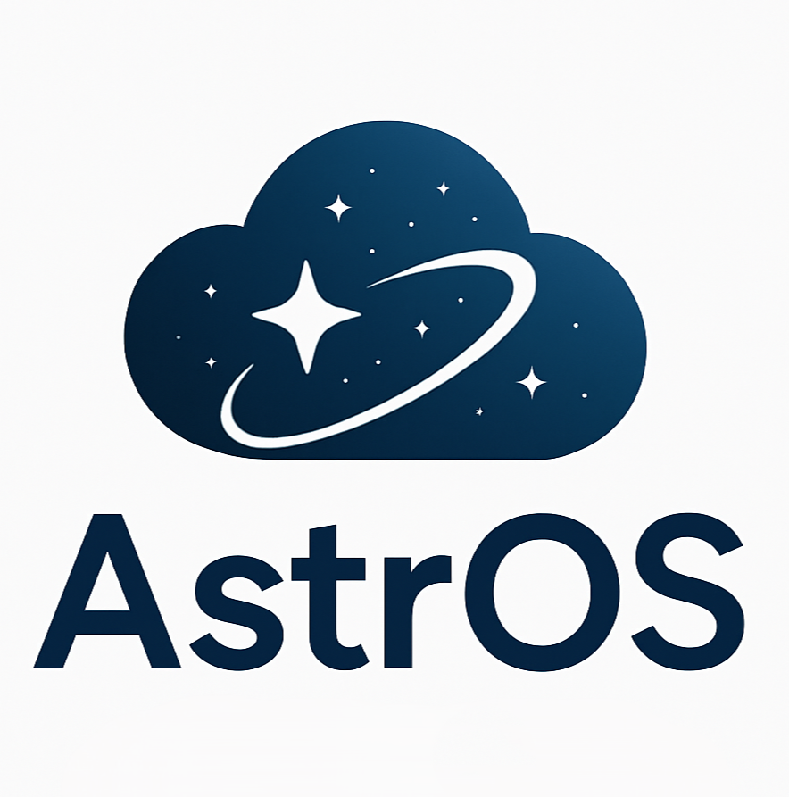
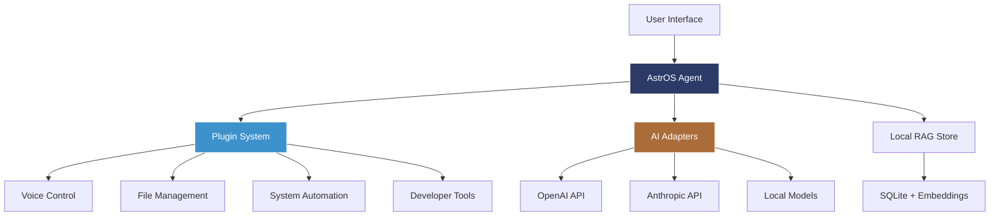

# AstrOS Project 🚀

<div align="center">



**The World's First AI-Integrated Operating System**


[](https://opensource.org/licenses/Apache-2.0)
[](https://ubuntu.com/)
[](https://python.org/)
[](CONTRIBUTING.md)
[](https://discord.gg/9qQstuyt)

[🚀 **Get Started**](GETTING_STARTED.md) • [🔑 **API Setup**](API_SETUP.md) • [📖 **Documentation**](https://docs.astros.org) • [🗺️ **Roadmap**](ROADMAP.md) • [� **Community**](https://discord.gg/9qQstuyt) • [🤝 **Contributing**](CONTRIBUTING_API.md)

</div>

---

## 🎯 What is AstrOS?

AstrOS is an open-source, AI-first Linux operating system built on Ubuntu LTS that transforms how you interact with your computer. Instead of clicking through menus and remembering complex commands, you simply talk to your OS in natural language.

### ✨ Key Features

- � **API-First AI Architecture** - Powered by GPT-OSS-20B (microsoft/wizardlm-2-8x22b) for intelligent responses
- �🗣️ **Natural Language Control** - Ask any question or give any command in natural language
- 🤖 **GPT-Powered Intelligence** - OpenRouter integration with response customization system
- 🧠 **Smart Local Tools** - Local execution combined with AI-generated intelligent responses  
- 🔒 **Privacy-First Design** - Your data stays local, you control what goes to the cloud
- 🧩 **Plugin Ecosystem** - Extensible architecture with AI-enhanced community plugins
- 🛡️ **Built on Ubuntu LTS** - Rock-solid foundation with excellent hardware support
- 🌐 **Open Source** - Fully auditable, community-driven development
- 💰 **Cost-Effective** - Use OpenRouter for cheaper API access than direct OpenAI

---

## 🏗️ Project Repositories

<table>
<tr>
<td width="50%">

### 🔥 Core Components
- **[astros-core]** - Main AI agent and system orchestrator
- **[astros-plugins]** - Official plugin collection
- **[astros-ui]** - User interfaces and desktop integration
- **[astros-ubuntu-iso]** - Ubuntu-based ISO builder

</td>
<td width="50%">

### 📚 Documentation & Tools
- **[astros-docs]** - Official documentation
- **[astros-website]** - Project website source
- **[astros-ci]** - Shared CI/CD workflows
- **[community]** - Community guidelines and discussions

</td>
</tr>
</table>

---

## � API Setup for Enhanced AI Features

AstrOS supports powerful GPT integration! Contributors can bring their own API keys for enhanced capabilities:

### 📋 Quick API Setup

**Option 1: OpenRouter (Recommended - Cheaper) 💰**
```bash
# Sign up at https://openrouter.ai (cheaper than OpenAI direct)
export ASTROS_OPENAI_API_KEY="sk-or-v1-your-openrouter-key"
export ASTROS_OPENAI_BASE_URL="https://openrouter.ai/api/v1"
export ASTROS_OPENAI_MODEL="openai/gpt-4"
export ASTROS_ENABLE_OPENAI=true
```

**Option 2: OpenAI Direct**
```bash
# Get API key from https://platform.openai.com/api-keys
export ASTROS_OPENAI_API_KEY="sk-your-openai-key"
export ASTROS_ENABLE_OPENAI=true
```

**📖 [Complete API Setup Guide →](API_SETUP.md)**

### 🆓 Local Mode (No API Required)
AstrOS works great without any API keys using local AI processing!

---

## �🚀 Quick Start

### For Users
```bash
# Download the latest AstrOS Ubuntu ISO
wget https://releases.astros.org/latest/astros-ubuntu-24.04-amd64.iso

# Or install on existing Ubuntu system
sudo add-apt-repository ppa:astros/stable
sudo apt update && sudo apt install astros-desktop
```

### For Developers
```bash
# Clone and set up development environment
git clone https://github.com/CoreOrganizations/AstrOS.git
cd AstrOS

# Set up Python environment
python -m venv venv
source venv/bin/activate  # Linux/Mac
# or venv\Scripts\activate  # Windows

# Install dependencies
pip install -e .

# Optional: Add your API key for enhanced AI features
export ASTROS_OPENAI_API_KEY="your-key-here"  # OpenAI or OpenRouter
export ASTROS_ENABLE_OPENAI=true

# Run AstrOS
python demo_enhanced.py
```

---

## 🎬 See AstrOS in Action

<div align="center">

[](https://www.youtube.com/watch?v=YOUR_VIDEO_ID)

*Click to watch: AstrOS transforming everyday computing tasks*

</div>

### Example Use Cases

```bash
# Natural language file management
"Move all my photos from Downloads to Pictures and organize by date"

# Intelligent development assistance  
"Set up a new Python project with FastAPI and PostgreSQL"

# Smart system automation
"When I plug in my headphones, switch to focus mode and open my coding playlist"

# Voice-controlled productivity
"Schedule a meeting with the team for tomorrow at 2 PM and send calendar invites"
```

---

## 🏛️ Architecture Overview

<div align="center">



</div>

**Core Components:**
- **🧠 AstrOS Agent** - Python-based orchestrator running as systemd service
- **🔌 Plugin System** - Modular architecture for extensible functionality
- **🤖 AI Adapters** - Abstraction layer for different AI providers
- **💾 Local RAG** - Privacy-focused local knowledge storage
- **🖥️ Desktop Integration** - GNOME Shell extensions and native UI components

---

## 🌟 Why AstrOS?

<table>
<tr>
<td width="33%">

### 🎯 For End Users
- **Intuitive Computing** - No more memorizing commands or navigating complex menus
- **Intelligent Automation** - Your computer learns and adapts to your workflow
- **Privacy Control** - Decide what data leaves your device
- **Productivity Boost** - AI-powered workflows that save real time

</td>
<td width="33%">

### 👨‍💻 For Developers  
- **Modern Stack** - Python-first with contemporary tools and practices
- **Plugin Architecture** - Easy-to-build extensions with simple APIs
- **Open Source** - No black boxes, everything is auditable
- **Ubuntu Foundation** - Familiar development environment

</td>
<td width="33%">

### 🏢 For Organizations
- **Enterprise Security** - Audit-ready, compliant AI integration
- **Cost Effective** - Open source with optional commercial support
- **Customizable** - Tailor AI features to organizational needs
- **Future Proof** - Built on established standards

</td>
</tr>
</table>

---

## 🤝 Contributing

We're building the future of computing, and we need your help! AstrOS is a community-driven project welcoming contributors of all skill levels.

### 🔑 Contributors: Bring Your Own API Key
Contributors can enhance AstrOS with their own OpenAI or OpenRouter API keys for advanced testing and development. See our [API Setup Guide](API_SETUP.md) and [Contributing Guide](CONTRIBUTING_API.md) for details.

### 🎯 Ways to Contribute

<table>
<tr>
<td>

**🐛 Found a Bug?**
- [Report Issues](https://github.com/AstrOS-Project/astros-core/issues/new?template=bug_report.md)
- Help with bug verification
- Test on different hardware

</td>
<td>

**💡 Have Ideas?**
- [Request Features](https://github.com/AstrOS-Project/astros-core/issues/new?template=feature_request.md)
- Join design discussions
- Propose improvements

</td>
<td>

**🔧 Want to Code?**
- Check [Good First Issues](https://github.com/search?q=org%3AAstrOS-Project+label%3A%22good+first+issue%22&type=issues)
- Build awesome plugins
- Improve core functionality

</td>
</tr>
</table>

### 🏷️ Current Focus Areas

-  **Core Agent Development** - Python developers for main AstrOS agent
-  **UI Components** - Frontend developers for user interfaces  
-  **System Integration** - Linux enthusiasts for Ubuntu customization
-  **AI Features** - ML engineers for model integration
-  **Documentation** - Technical writers for user guides

### 📋 Getting Started

1. **[Quick Start Guide](GETTING_STARTED.md)** - Set up AstrOS in 5 minutes
2. **[API Setup Guide](API_SETUP.md)** - Configure OpenAI/OpenRouter for enhanced AI
3. **[Contributing Guide](CONTRIBUTING_API.md)** - Essential information for new contributors
4. **Join our [Discord Community](https://discord.gg/astros)** - Chat with maintainers and other contributors  
5. **Pick an Issue** - Start with issues labeled [`good first issue`](https://github.com/search?q=org%3ACorOrganizations+label%3A%22good+first+issue%22&type=issues)

---

## 📊 Project Status

<div align="center">


</div>

### 🎯 Current Milestone: **Foundation Phase** (Q1 2025)

- ✅ Project architecture defined
- ✅ Core repositories created  
- ✅ Community guidelines established
- 🔄 **In Progress**: Core Python agent development
- 🔄 **In Progress**: First Ubuntu ISO build
- ⏳ **Next**: Plugin system implementation

[📅 View Full Roadmap](ROADMAP.md)

---

## 🌐 Community & Support

<div align="center">

### Join Our Community

[]
[]
[]
[]

</div>

### 📞 Get Help

- **💬 Community Chat**: Real-time help on [Discord]
- **🐛 Bug Reports**: [GitHub Issues](https://github.com/AstrOS-Project/astros-core/issues)
- **📖 Documentation**: [docs.astros.org](https://docs.astros.org)
- **🏫 Tutorials**: [YouTube Channel]

### 📰 Stay Updated

- **📧 Newsletter**: [Subscribe](https://astros.org/newsletter) for monthly updates
- **📱 Social Media**: Follow us on [Twitter](https://twitter.com/AstrOSProject) for daily updates
- **📝 Blog**: Read our [development blog](https://blog.astros.org) for technical deep-dives

---

## 📜 License & Legal

AstrOS is released under the [Apache License 2.0](LICENSE), which means:

- ✅ **Commercial Use** - Use AstrOS in commercial products
- ✅ **Modification** - Modify and distribute your changes
- ✅ **Distribution** - Distribute original or modified versions
- ✅ **Patent Rights** - Express grant of patent rights from contributors
- ❗ **Trademark** - AstrOS trademarks are not covered by this license

### 🛡️ Security

We take security seriously. If you discover a security vulnerability, please:
- **DO NOT** create a public GitHub issue
- Email us at: **aiastros2025@gmail.com**
- Include detailed reproduction steps
- We'll acknowledge within 48 hours

[🔒 View our Security Policy](SECURITY.md)

---

## 🎉 Acknowledgments

AstrOS is built on the shoulders of giants. Special thanks to:

- **Ubuntu Team** - For providing the solid foundation we build upon
- **Python Community** - For the incredible ecosystem and tools
- **AI Research Community** - For advancing the field that makes AstrOS possible
- **Open Source Contributors** - For believing in the power of collaborative development
- **Early Adopters & Testers** - For helping us build something amazing

---

<div align="center">

### 🚀 Ready to Build the Future?

**[⭐ Star us on GitHub](https://github.com/AstrOS-Project)** • **[🤝 Join the Community](https://discord.gg/astros)** • **[📝 Start Contributing](CONTRIBUTING.md)**

---

*Made with ❤️ by the AstrOS community*

**© 2025 AstrOS Project. Licensed under Apache 2.0.**

</div>
