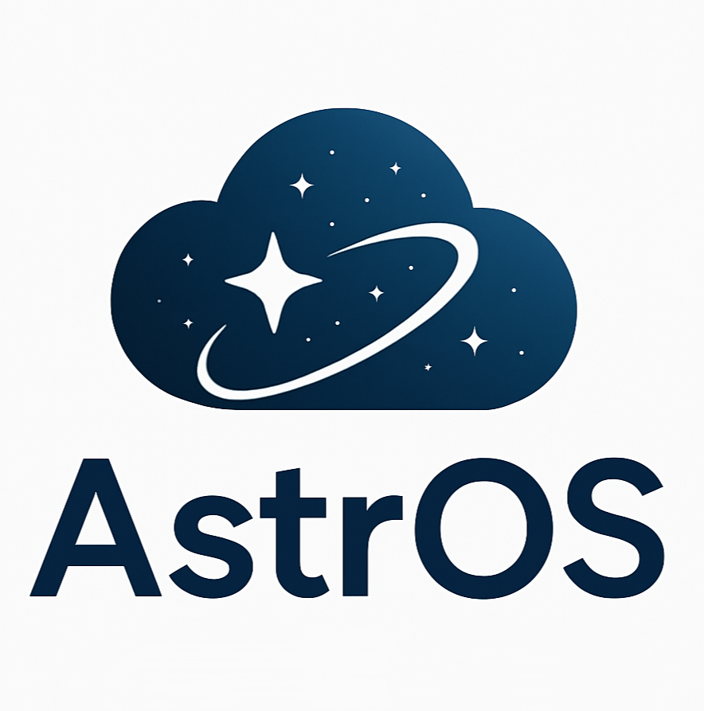

# AstrOS Project ✨

<div align="center">



**The AI-Integrated Operating System**


[](https://opensource.org/licenses/Apache-2.0)
[](https://ubuntu.com/)
[](https://python.org/)
[](CONTRIBUTING.md)
[](https://discord.gg/9qQstuyt)

[🚀 **Get Started**](GETTING_STARTED.md) • [🔑 **API Setup**](API_SETUP.md) • [📖 **Documentation**](https://docs.astros.org) • [🗺️ **Roadmap**](ROADMAP.md) • [� **Community**](https://discord.gg/9qQstuyt) • [🤝 **Contributing**](CONTRIBUTING_API.md)

</div>

---

## 🎯 What is AstrOS?

AstrOS is a complete Ubuntu-based operating system with native AI capabilities built into the OS layer. Instead of running AI as an application, AstrOS integrates AI directly into the system, making your entire desktop intelligent.

Talk to your OS, automate tasks, control applications, manage files, and enhance productivity—all through natural language and AI-powered system services.

### ✨ What Makes AstrOS Different?

Not just another Linux distro - AstrOS fundamentally reimagines how you interact with your computer:

- 🖥️ **OS-Level AI Integration** - AI runs as a native system service, not an app
- 🎙️ **Voice-First Interface** - Control your entire system with natural language
- 🔧 **Intelligent Automation** - System learns your workflows and automates them
- 🎨 **Custom Desktop Environment** - Modified GNOME with AI-enhanced widgets
- � **Pre-Configured & Optimized** - Everything works out of the box
- 🔒 **Privacy-Focused** - Local AI processing with optional cloud features
- 🛡️ **Ubuntu LTS Foundation** - Stable, secure, and hardware-compatible
- 🌐 **Fully Open Source** - Every component is auditable and modifiable

---

## 🌟 Key Features

### 🤖 Native AI System Service

- **astros-agent** - SystemD service running AI orchestrator
- **Global AI Hotkey** - Super + Space to invoke AI from anywhere
- **Context-Aware** - AI knows what application you're using
- **Multi-Model Support** - Local models + cloud APIs (OpenAI, Anthropic, etc.)

### 🎨 Custom Desktop Experience

- **AstrOS Desktop** - Modified GNOME Shell with AI widgets
- **AI Command Palette** - Quick access to AI features
- **Smart Notifications** - AI-filtered and prioritized
- **Intelligent Search** - Natural language file and app search
- **Voice Control** - Full system control via speech

### 🔌 Deep System Integration

- **File Management** - AI-powered organization and search
- **Application Control** - Launch, manage, and automate apps
- **System Settings** - Natural language configuration
- **Package Management** - "Install the latest video editor"
- **Network Management** - Smart connectivity and troubleshooting

### 🛠️ Developer Tools

- **Code Assistant** - Built-in AI coding help
- **Terminal Integration** - AI-powered command suggestions
- **Git Integration** - Natural language version control
- **Project Management** - Intelligent workspace organization
- **Documentation Generator** - Auto-generate code docs

### 🎯 Productivity Features

- **Smart Workspace Switching** - AI-organized virtual desktops
- **Focus Mode** - AI-managed distraction blocking
- **Task Automation** - Record and replay workflows
- **Calendar Integration** - AI scheduling assistant
- **Email Management** - Smart filtering and responses

---

## 🏗️ Architecture Overview

```
┌─────────────────────────────────────────────────────────────┐
│                    User Interface Layer                     │
│   GNOME Shell Extensions  │  AI Widgets  │  Voice Input     │
├─────────────────────────────────────────────────────────────┤
│                  AstrOS Desktop Environment                 │
│   Custom Themes  │  AI Command Palette  │  Smart Search    │
├─────────────────────────────────────────────────────────────┤
│               AstrOS Core System Services                   │
│  astros-agent (AI Orchestrator)  │  astros-voice  │ plugins│
├─────────────────────────────────────────────────────────────┤
│                    System Integration Layer                 │
│  D-Bus Bridge  │  SystemD Services  │  PolicyKit Rules     │
├─────────────────────────────────────────────────────────────┤
│                   AI Processing Layer                       │
│  Local Models (Ollama)  │  Cloud APIs  │  RAG System       │
├─────────────────────────────────────────────────────────────┤
│                    Ubuntu 24.04 LTS Base                    │
│  Kernel  │  SystemD  │  GNOME  │  Standard Packages        │
└─────────────────────────────────────────────────────────────┘
```

### 🔧 Core Components

**1. astros-agent (Core AI Service)**
- Language: Python 3.12+
- Location: `/usr/lib/astros/agent/`
- Service: `astros-agent.service`
- Function: Main AI orchestrator, plugin manager, context handler

**2. astros-desktop (Desktop Environment)**
- Base: GNOME 46 (modified)
- Location: `/usr/share/gnome-shell/extensions/astros@astros.org/`
- Function: Custom UI elements, AI widgets, command palette

**3. astros-plugins (Plugin System)**
- Location: `/usr/lib/astros/plugins/`
- Types: System, File, App, Network, Developer, Productivity
- Function: Extend AI capabilities with specific tools

**4. astros-voice (Voice Control)**
- Engine: Whisper (local) + cloud options
- Location: `/usr/lib/astros/voice/`
- Function: Speech-to-text and text-to-speech

**5. astros-models (AI Models)**
- Local: Ollama integration
- Cloud: OpenAI, Anthropic, Google APIs
- Location: `/var/lib/astros/models/`
- Function: Manage and route AI inference

---

## 🎯 Usage Examples

### 🗣️ Voice Commands

```bash
# Activate AI: Press Super + Space or say "Hey AstrOS"

"Show me all Python files I edited yesterday"
"Install Docker and set it up for my project"
"Switch to focus mode and block social media for 2 hours"
"Organize my Downloads folder by file type"
"Create a new React project called 'my-app'"
"What's using the most CPU right now?"
"Schedule a backup of my Documents folder every night"
```

### 💻 Terminal Integration

```bash
# AI command suggestions
$ astros suggest "compress video file"
→ ffmpeg -i input.mp4 -vcodec h264 -acodec mp3 output.mp4

# Natural language commands
$ astros "find large files in home directory"
→ Executing: find ~/ -type f -size +100M -exec ls -lh {} \;

# Automated troubleshooting
$ astros "why is my wifi not working"
→ Diagnosing network issues...
```

### 🎨 Desktop Features

- **AI Sidebar**: Always-available chat interface (Ctrl+Alt+A)
- **Smart App Launcher**: Type what you want to do, not app names
- **Intelligent Clipboard**: AI-enhanced copy/paste with history
- **Context Menus**: Right-click anywhere for AI actions
- **Quick Actions**: Customizable AI shortcuts

---

## 🔌 Plugin System

AstrOS uses a powerful plugin architecture for extensibility.

### 📦 Official Plugins (Pre-installed)

| Plugin | Description | Examples |
|--------|-------------|----------|
| file-manager | AI file operations | "Find all photos from last summer" |
| app-control | Launch and manage apps | "Open my code editor and browser" |
| system-config | System settings | "Enable dark mode and increase volume" |
| package-manager | Software installation | "Install GIMP and Inkscape" |
| network-tools | Network management | "Connect to office VPN" |
| developer-tools | Coding assistance | "Create a Python virtual environment" |
| text-editor | Document editing | "Fix grammar in this document" |
| web-browser | Browser automation | "Open GitHub and check my PRs" |
| calendar | Schedule management | "What's on my calendar tomorrow" |
| email | Email operations | "Show unread emails from my boss" |

### 🛠️ Community Plugins

Browse and install from the AstrOS Plugin Store:

```bash
astros-plugins search "video editor"
astros-plugins install astros-plugin-kdenlive
astros-plugins enable astros-plugin-kdenlive
```

### 👨‍💻 Create Your Own Plugin

```bash
# Generate plugin template
astros-plugins create my-awesome-plugin

# Plugin structure
my-awesome-plugin/
├── manifest.json          # Plugin metadata
├── plugin.py             # Main plugin code
├── config.yaml           # Configuration
├── requirements.txt      # Dependencies
└── README.md            # Documentation
```

📖 **[Plugin Development Guide →](docs/CONTRIBUTING.md)**

---

## 🏛️ Project Structure

```
AstrOS/
├── iso-builder/                 # Ubuntu ISO customization
│   ├── packages/               # Pre-installed packages
│   ├── overlays/              # File system overlays
│   ├── preseed/               # Automated installer config
│   └── build-iso.sh           # ISO build script
│
├── astros-core/                # Core system components
│   ├── agent/                 # AI orchestrator service
│   ├── plugins/               # Plugin system
│   ├── dbus/                  # D-Bus interfaces
│   └── systemd/               # Service definitions
│
├── astros-desktop/             # Desktop environment
│   ├── gnome-shell/           # GNOME extensions
│   ├── themes/                # Visual themes
│   ├── widgets/               # AI widgets
│   └── settings/              # Configuration panels
│
├── astros-voice/               # Voice control
│   ├── whisper/               # Speech recognition
│   ├── tts/                   # Text-to-speech
│   └── hotword/               # Wake word detection
│
├── astros-plugins/             # Official plugins
│   ├── file-manager/
│   ├── app-control/
│   ├── system-config/
│   └── ...
│
├── astros-models/              # AI model management
│   ├── ollama/                # Local model integration
│   ├── openai/                # OpenAI API client
│   └── rag/                   # RAG system
│
├── docs/                       # Documentation
│   ├── installation.md
│   ├── user-guide.md
│   ├── plugin-development.md
│   └── architecture.md
│
├── tests/                      # Testing suite
│   ├── iso/                   # ISO build tests
│   ├── integration/           # Integration tests
│   └── e2e/                   # End-to-end tests
│
└── tools/                      # Development tools
    ├── build/                 # Build scripts
    ├── ci/                    # CI/CD configuration
    └── debug/                 # Debugging utilities
```

---

## 🚀 Development Setup

### For Contributors

```bash
# Clone repository
git clone https://github.com/CoreOrganizations/AstrOS.git
cd AstrOS

# Install build dependencies
sudo apt install -y \
    debootstrap squashfs-tools xorriso \
    isolinux syslinux-utils genisoimage \
    python3-pip python3-venv nodejs npm

# Set up development environment
./tools/setup-dev-env.sh

# Build AstrOS ISO (takes 30-60 minutes)
cd iso-builder
sudo ./build-iso.sh

# Test in VM
./tools/test-vm.sh build/astros-24.04-amd64.iso
```

### For Testing Core Components

```bash
# Test AI agent without full OS
cd astros-core/agent
python3 -m venv venv
source venv/bin/activate
pip install -r requirements.txt
python test_agent.py

# Test plugins
cd astros-plugins/file-manager
pytest tests/

# Test GNOME extension
cd astros-desktop/gnome-shell/astros@astros.org
gnome-extensions pack
gnome-extensions install astros@astros.org.shell-extension.zip
```

📖 **[Development Guide →](docs/CONTRIBUTING.md)**

---

## 🤝 Contributing

We're building the future of computing, and we need your help! AstrOS is a community-driven project welcoming contributors of all skill levels.

### 🎯 Current Focus Areas

| Area | Skills Needed | Issues |
|------|---------------|--------|
| ISO Builder | Bash, Linux internals | [#issues/iso](#) |
| AI Agent | Python, AI/ML | [#issues/agent](#) |
| Desktop Environment | JavaScript, GNOME | [#issues/desktop](#) |
| Plugin Development | Python, APIs | [#issues/plugins](#) |
| Voice System | Audio processing, ML | [#issues/voice](#) |
| Documentation | Technical writing | [#issues/docs](#) |
| Testing | QA, automation | [#issues/testing](#) |

### 📋 Getting Started

1. **[Quick Start Guide](docs/GETTING_STARTED.md)** - Set up AstrOS in 5 minutes
2. **[API Setup Guide](docs/API_SETUP.md)** - Configure OpenAI/OpenRouter for enhanced AI
3. **[Contributing Guide](docs/CONTRIBUTING.md)** - Essential information for new contributors
4. **Join our [Discord Community](https://discord.gg/9qQstuyt)** - Chat with maintainers and other contributors  
5. **Pick an Issue** - Start with issues labeled [`good first issue`](https://github.com/search?q=org%3ACoreOrganizations+label%3A%22good+first+issue%22&type=issues)

---

## 📊 Project Status

<div align="center">


</div>

### 🎯 Current Phase: Alpha Development (v0.1.x)

- ✅ Architecture finalized
- ✅ ISO build pipeline working
- 🔄 Core AI agent (70% complete)
- 🔄 Desktop environment (40% complete)
- 🔄 Plugin system (60% complete)
- ⏳ Voice control (planned)
- ⏳ First alpha release (Q1 2025)

[📅 View Detailed Roadmap](ROADMAP.md)

---

## 🌐 Community & Support

<div align="center">

### Join Our Community

[](https://discord.gg/9qQstuyt)

</div>

### 🪽 Get Help

- **💬 Community Chat**: Real-time help on [Discord](https://discord.gg/9qQstuyt)
- **🐛 Bug Reports**: [GitHub Issues](https://github.com/CoreOrganizations/AstrOS/issues)
- **� Email**: aiastros2025@gmail.com
- **�📖 Documentation**: [docs.astros.org](https://docs.astros.org)

---

## 📜 License & Legal

AstrOS is released under the [Apache License 2.0](LICENSE), which means:

- ✅ **Commercial Use** - Use AstrOS in commercial products
- ✅ **Modification** - Modify and distribute your changes
- ✅ **Distribution** - Distribute original or modified versions
- ✅ **Patent Rights** - Express grant of patent rights from contributors
- ❗ **Trademark** - AstrOS trademarks are not covered by this license

### 🛡️ Security

We take security seriously. If you discover a security vulnerability, please:
- **DO NOT** create a public GitHub issue
- Email us at: **aiastros2025@gmail.com**
- Include detailed reproduction steps
- We'll acknowledge within 48 hours

[🔒 View our Security Policy](SECURITY.md)

---

## 🎉 Acknowledgments

AstrOS is built on the shoulders of giants. Special thanks to:

- **Ubuntu/Canonical** - Stable Linux foundation
- **GNOME Project** - Desktop environment
- **Ollama** - Local AI model runtime
- **Python Community** - Core development language
- **Open Source Community** - Making this possible

---

<div align="center">

### 🚀 Ready to Build the AI-Powered OS?

**[⭐ Star us on GitHub](https://github.com/CoreOrganizations/AstrOS)** • **[🤝 Join the Community](https://discord.gg/9qQstuyt)** • **[📝 Start Contributing](docs/CONTRIBUTING.md)**

---

*Made with ❤️ by the AstrOS community*

**© 2025 AstrOS Project. Licensed under Apache 2.0.**

</div>
