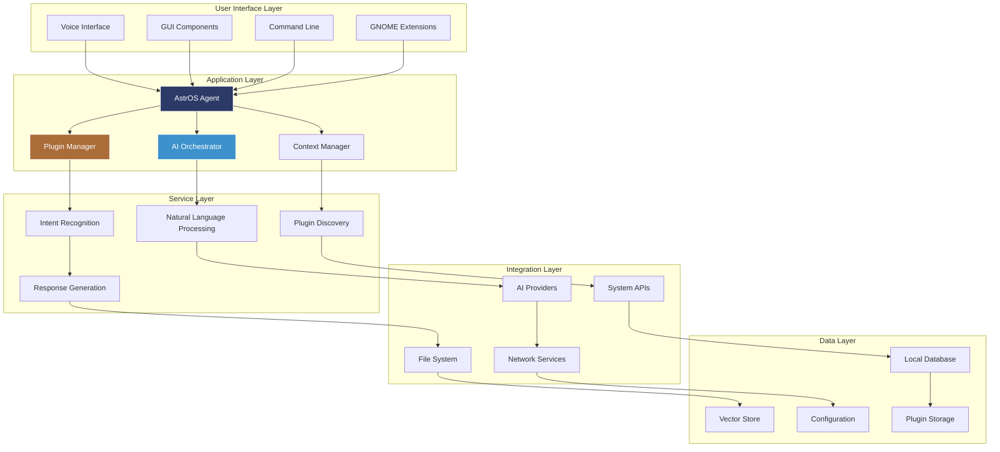
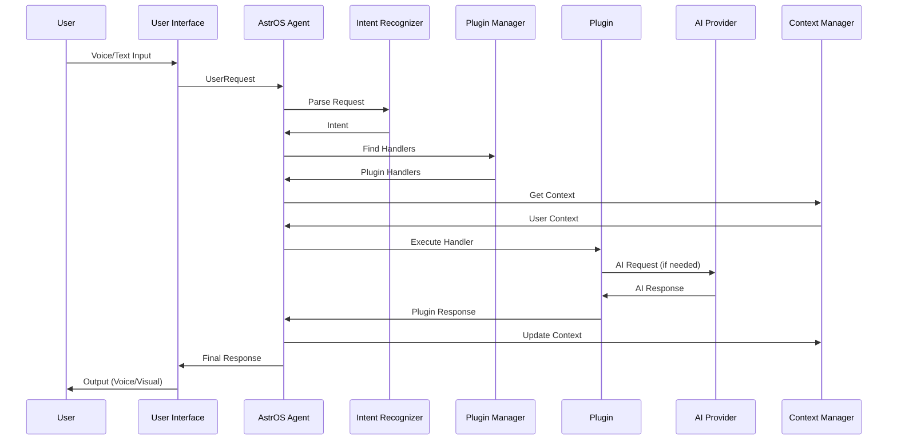
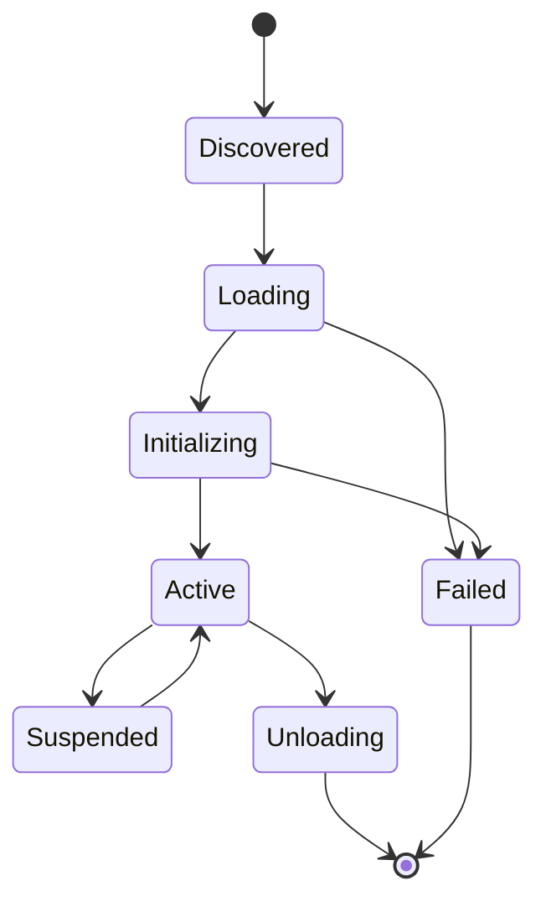

# AstrOS Architecture Overview 🏗️

This document provides a comprehensive overview of AstrOS's system architecture, design principles, and component interactions.

## 📋 Table of Contents

- [System Overview](#-system-overview)
- [Core Components](#-core-components)
- [Data Flow](#-data-flow)
- [Plugin Architecture](#-plugin-architecture)
- [AI Integration](#-ai-integration)
- [Storage & Persistence](#-storage--persistence)
- [Security Model](#-security-model)
- [Performance Considerations](#-performance-considerations)
- [Deployment Architecture](#-deployment-architecture)

---

## 🌐 System Overview

AstrOS is designed as a modular, AI-first operating system that seamlessly integrates artificial intelligence into everyday computing tasks. The architecture follows modern software design principles with emphasis on modularity, security, and performance.

### Design Principles

<table>
<tr>
<td width="50%">

#### 🎯 **Core Principles**
- **AI-First Design**: Natural language as primary interface
- **Privacy by Design**: Local processing with optional cloud features
- **Modular Architecture**: Extensible plugin-based system
- **Open Source**: Transparent, auditable, community-driven

</td>
<td width="50%">

#### 🛡️ **Quality Attributes**
- **Security**: Zero-trust security model
- **Performance**: Sub-second response times
- **Reliability**: 99.9% uptime target
- **Scalability**: Supports thousands of plugins

</td>
</tr>
</table>

### High-Level Architecture



---

## 🔧 Core Components

### AstrOS Agent

The central orchestrator that manages all system interactions.

```python
# Core Agent Architecture
class AstrOSAgent:
    """Main system orchestrator."""
    
    def __init__(self, config_path: str):
        self.config = Config.load(config_path)
        self.plugin_manager = PluginManager(self.config.plugins)
        self.ai_orchestrator = AIOrchestrator(self.config.ai)
        self.context_manager = ContextManager()
        self.intent_recognizer = IntentRecognizer()
        self.response_generator = ResponseGenerator()
        
    async def process_request(self, request: UserRequest) -> Response:
        """Process user request through the complete pipeline."""
        
        # 1. Parse and understand the request
        intent = await self.intent_recognizer.recognize(request)
        
        # 2. Find appropriate plugins
        plugins = await self.plugin_manager.find_handlers(intent)
        
        # 3. Execute with context
        context = await self.context_manager.get_context(request.user_id)
        result = await self._execute_with_plugins(intent, plugins, context)
        
        # 4. Generate response
        response = await self.response_generator.generate(result, context)
        
        # 5. Update context
        await self.context_manager.update_context(request.user_id, intent, response)
        
        return response
```

### Plugin Manager

Handles plugin lifecycle, discovery, and execution.

```python
class PluginManager:
    """Manages plugin lifecycle and execution."""
    
    def __init__(self, config: PluginConfig):
        self.config = config
        self.loaded_plugins: Dict[str, BasePlugin] = {}
        self.plugin_registry = PluginRegistry()
        
    async def load_plugins(self) -> None:
        """Load all configured plugins."""
        for plugin_name in self.config.enabled_plugins:
            await self._load_plugin(plugin_name)
    
    async def find_handlers(self, intent: Intent) -> List[PluginHandler]:
        """Find plugins that can handle the given intent."""
        handlers = []
        
        for plugin in self.loaded_plugins.values():
            if plugin.can_handle(intent):
                handlers.extend(plugin.get_handlers(intent))
        
        # Sort by priority and confidence
        handlers.sort(key=lambda h: (h.priority, h.confidence), reverse=True)
        return handlers
    
    async def execute_handler(
        self, 
        handler: PluginHandler, 
        intent: Intent, 
        context: Context
    ) -> Response:
        """Execute a plugin handler safely."""
        try:
            return await handler.execute(intent, context)
        except Exception as e:
            logger.error(f"Plugin handler failed: {e}")
            return Response(
                success=False, 
                message="Plugin execution failed",
                error=str(e)
            )
```

### AI Orchestrator

Manages AI provider interactions and model selection.

```python
class AIOrchestrator:
    """Orchestrates AI provider interactions."""
    
    def __init__(self, config: AIConfig):
        self.config = config
        self.providers: Dict[str, BaseAIProvider] = {}
        self.model_router = ModelRouter(config.routing)
        
    async def process_with_ai(
        self, 
        request: str, 
        context: Context,
        requirements: AIRequirements
    ) -> AIResponse:
        """Process request with appropriate AI model."""
        
        # Select best provider and model
        provider, model = await self.model_router.select_model(
            request, requirements
        )
        
        # Prepare context and prompt
        enhanced_prompt = await self._prepare_prompt(request, context)
        
        # Execute with retry logic
        return await self._execute_with_retry(
            provider, model, enhanced_prompt
        )
    
    async def _prepare_prompt(self, request: str, context: Context) -> str:
        """Prepare enhanced prompt with context."""
        system_prompt = self._get_system_prompt()
        context_info = await context.get_relevant_context(request)
        
        return f"""
        {system_prompt}
        
        Context: {context_info}
        
        User Request: {request}
        """
```

---

## 🔄 Data Flow

### Request Processing Pipeline



### Data Types and Structures

```python
# Core data structures
@dataclass
class UserRequest:
    """Represents a user request."""
    text: str
    user_id: str
    session_id: str
    timestamp: datetime
    input_method: InputMethod  # voice, text, gui
    metadata: Dict[str, Any]

@dataclass
class Intent:
    """Parsed user intent."""
    type: str
    confidence: float
    entities: Dict[str, Any]
    context: Dict[str, Any]
    original_request: UserRequest

@dataclass
class Response:
    """System response to user."""
    success: bool
    message: str
    data: Optional[Dict[str, Any]]
    suggestions: List[str]
    requires_followup: bool
    metadata: Dict[str, Any]

@dataclass
class Context:
    """User and session context."""
    user_id: str
    session_id: str
    conversation_history: List[Intent]
    user_preferences: UserPreferences
    system_state: SystemState
    active_tasks: List[Task]
```

---

## 🧩 Plugin Architecture

### Plugin Lifecycle



### Plugin Communication

```python
# Plugin communication patterns
class PluginCommunicationBus:
    """Enables secure inter-plugin communication."""
    
    def __init__(self):
        self.subscribers: Dict[str, List[Callable]] = {}
        self.message_queue = asyncio.Queue()
        
    async def publish(self, event: str, data: Any, sender: str) -> None:
        """Publish event to interested plugins."""
        message = PluginMessage(
            event=event,
            data=data,
            sender=sender,
            timestamp=datetime.now()
        )
        
        await self.message_queue.put(message)
    
    async def subscribe(self, event: str, handler: Callable, plugin: str) -> None:
        """Subscribe to events."""
        if event not in self.subscribers:
            self.subscribers[event] = []
        
        self.subscribers[event].append({
            'handler': handler,
            'plugin': plugin
        })
    
    async def _process_messages(self) -> None:
        """Process message queue."""
        while True:
            message = await self.message_queue.get()
            
            if message.event in self.subscribers:
                for subscriber in self.subscribers[message.event]:
                    try:
                        await subscriber['handler'](message)
                    except Exception as e:
                        logger.error(f"Subscriber error: {e}")
```

### Plugin Security Model

```python
class PluginSandbox:
    """Provides secure execution environment for plugins."""
    
    def __init__(self, plugin_config: PluginConfig):
        self.config = plugin_config
        self.permissions = PermissionManager()
        self.resource_monitor = ResourceMonitor()
        
    async def execute_plugin(
        self, 
        plugin: BasePlugin, 
        handler: str, 
        intent: Intent
    ) -> Response:
        """Execute plugin in sandboxed environment."""
        
        # Check permissions
        if not await self._check_permissions(plugin, intent):
            raise PermissionDeniedError("Insufficient permissions")
        
        # Set resource limits
        limits = ResourceLimits(
            max_memory=self.config.max_memory,
            max_cpu_time=self.config.max_cpu_time,
            max_file_size=self.config.max_file_size
        )
        
        # Execute with monitoring
        with self.resource_monitor.monitor(limits):
            return await plugin.execute_handler(handler, intent)
    
    async def _check_permissions(
        self, 
        plugin: BasePlugin, 
        intent: Intent
    ) -> bool:
        """Check if plugin has required permissions."""
        required_permissions = plugin.get_required_permissions(intent)
        
        for permission in required_permissions:
            if not await self.permissions.check(plugin.name, permission):
                return False
        
        return True
```

---

## 🤖 AI Integration

### AI Provider Architecture

```python
# AI provider abstraction
class BaseAIProvider(ABC):
    """Base class for AI providers."""
    
    @abstractmethod
    async def complete(
        self, 
        prompt: str, 
        **kwargs
    ) -> AIResponse:
        """Generate text completion."""
        pass
    
    @abstractmethod
    async def chat(
        self, 
        messages: List[Message], 
        **kwargs
    ) -> AIResponse:
        """Generate chat response."""
        pass
    
    @abstractmethod
    async def embed(
        self, 
        texts: List[str]
    ) -> List[List[float]]:
        """Generate embeddings."""
        pass

# Specific provider implementations
class OpenAIProvider(BaseAIProvider):
    """OpenAI API provider."""
    
    def __init__(self, config: OpenAIConfig):
        self.client = openai.AsyncOpenAI(api_key=config.api_key)
        self.config = config
    
    async def complete(self, prompt: str, **kwargs) -> AIResponse:
        response = await self.client.completions.create(
            model=kwargs.get('model', self.config.default_model),
            prompt=prompt,
            max_tokens=kwargs.get('max_tokens', 150)
        )
        
        return AIResponse(
            content=response.choices[0].text,
            tokens_used=response.usage.total_tokens,
            model=response.model
        )

class LocalAIProvider(BaseAIProvider):
    """Local AI model provider."""
    
    def __init__(self, config: LocalAIConfig):
        self.model_path = config.model_path
        self.model = self._load_model()
    
    def _load_model(self):
        """Load local model (e.g., using llama.cpp)."""
        from llama_cpp import Llama
        
        return Llama(
            model_path=self.model_path,
            chat_format="chatml",
            verbose=False
        )
    
    async def complete(self, prompt: str, **kwargs) -> AIResponse:
        response = self.model(
            prompt,
            max_tokens=kwargs.get('max_tokens', 150),
            temperature=kwargs.get('temperature', 0.7)
        )
        
        return AIResponse(
            content=response['choices'][0]['text'],
            tokens_used=response['usage']['total_tokens'],
            model="local"
        )
```

### AI Model Routing

```python
class ModelRouter:
    """Routes requests to appropriate AI models."""
    
    def __init__(self, config: RoutingConfig):
        self.config = config
        self.usage_tracker = UsageTracker()
        
    async def select_model(
        self, 
        request: str, 
        requirements: AIRequirements
    ) -> Tuple[str, str]:
        """Select best provider and model for request."""
        
        # Analyze request complexity
        complexity = await self._analyze_complexity(request)
        
        # Check privacy requirements
        if requirements.privacy_level == "strict":
            return self._select_local_model(complexity)
        
        # Check cost constraints
        if requirements.max_cost is not None:
            return self._select_cost_effective_model(complexity, requirements.max_cost)
        
        # Default to best performance
        return self._select_performance_model(complexity)
    
    async def _analyze_complexity(self, request: str) -> RequestComplexity:
        """Analyze request complexity."""
        word_count = len(request.split())
        has_code = any(keyword in request.lower() 
                      for keyword in ['code', 'function', 'class', 'script'])
        has_math = any(char in request 
                      for char in ['=', '+', '-', '*', '/', '(', ')'])
        
        if word_count > 100 or has_code:
            return RequestComplexity.HIGH
        elif word_count > 50 or has_math:
            return RequestComplexity.MEDIUM
        else:
            return RequestComplexity.LOW
```

---

## 💾 Storage & Persistence

### Database Architecture

```python
# Database layer
class DatabaseManager:
    """Manages all database operations."""
    
    def __init__(self, config: DatabaseConfig):
        self.config = config
        self.engine = create_async_engine(config.url)
        self.session_factory = async_sessionmaker(self.engine)
        
    async def initialize(self):
        """Initialize database schema."""
        async with self.engine.begin() as conn:
            await conn.run_sync(Base.metadata.create_all)
    
    @asynccontextmanager
    async def session(self):
        """Provide database session."""
        async with self.session_factory() as session:
            try:
                yield session
                await session.commit()
            except Exception:
                await session.rollback()
                raise
            finally:
                await session.close()

# Database models
class User(Base):
    __tablename__ = "users"
    
    id = Column(String, primary_key=True)
    name = Column(String, nullable=False)
    preferences = Column(JSON)
    created_at = Column(DateTime, default=datetime.utcnow)
    updated_at = Column(DateTime, default=datetime.utcnow, onupdate=datetime.utcnow)

class Session(Base):
    __tablename__ = "sessions"
    
    id = Column(String, primary_key=True)
    user_id = Column(String, ForeignKey("users.id"))
    started_at = Column(DateTime, default=datetime.utcnow)
    ended_at = Column(DateTime)
    context = Column(JSON)

class Intent(Base):
    __tablename__ = "intents"
    
    id = Column(String, primary_key=True)
    session_id = Column(String, ForeignKey("sessions.id"))
    text = Column(Text, nullable=False)
    intent_type = Column(String)
    confidence = Column(Float)
    timestamp = Column(DateTime, default=datetime.utcnow)
```

### Vector Storage for RAG

```python
class VectorStore:
    """Manages vector embeddings for semantic search."""
    
    def __init__(self, config: VectorConfig):
        self.config = config
        import chromadb
        self.client = chromadb.PersistentClient(path=config.storage_path)
        
    async def add_documents(
        self, 
        documents: List[str], 
        metadatas: List[Dict], 
        collection_name: str
    ):
        """Add documents to vector store."""
        collection = self.client.get_or_create_collection(collection_name)
        
        # Generate embeddings
        embeddings = await self._generate_embeddings(documents)
        
        # Add to collection
        collection.add(
            embeddings=embeddings,
            documents=documents,
            metadatas=metadatas,
            ids=[f"doc_{i}" for i in range(len(documents))]
        )
    
    async def search(
        self, 
        query: str, 
        collection_name: str, 
        n_results: int = 5
    ) -> List[Dict]:
        """Search for similar documents."""
        collection = self.client.get_collection(collection_name)
        
        # Generate query embedding
        query_embedding = await self._generate_embeddings([query])
        
        # Search
        results = collection.query(
            query_embeddings=query_embedding,
            n_results=n_results
        )
        
        return results
```

---

## 🛡️ Security Model

### Zero-Trust Architecture

```python
class SecurityManager:
    """Implements zero-trust security model."""
    
    def __init__(self, config: SecurityConfig):
        self.config = config
        self.auth_manager = AuthenticationManager()
        self.permission_manager = PermissionManager()
        self.audit_logger = AuditLogger()
        
    async def authenticate_request(self, request: UserRequest) -> AuthResult:
        """Authenticate user request."""
        # Verify user identity
        user = await self.auth_manager.verify_user(request.user_id)
        if not user:
            return AuthResult(success=False, reason="Invalid user")
        
        # Check session validity
        session = await self.auth_manager.verify_session(request.session_id)
        if not session:
            return AuthResult(success=False, reason="Invalid session")
        
        # Check request integrity
        if not await self._verify_request_integrity(request):
            return AuthResult(success=False, reason="Request integrity check failed")
        
        return AuthResult(success=True, user=user, session=session)
    
    async def authorize_action(
        self, 
        user: User, 
        action: str, 
        resource: str
    ) -> bool:
        """Authorize user action on resource."""
        # Check explicit permissions
        if await self.permission_manager.has_permission(user.id, action, resource):
            return True
        
        # Check role-based permissions
        roles = await self.permission_manager.get_user_roles(user.id)
        for role in roles:
            if await self.permission_manager.role_has_permission(role, action, resource):
                return True
        
        return False
    
    async def _verify_request_integrity(self, request: UserRequest) -> bool:
        """Verify request hasn't been tampered with."""
        # Implement request signing/verification
        # Check timestamps, signatures, etc.
        return True
```

### Plugin Security

```python
class PluginSecurityManager:
    """Manages plugin security and permissions."""
    
    def __init__(self):
        self.permission_store = PermissionStore()
        self.sandbox_manager = SandboxManager()
        
    async def validate_plugin(self, plugin_path: str) -> ValidationResult:
        """Validate plugin before loading."""
        try:
            # Static analysis
            static_result = await self._static_analysis(plugin_path)
            if not static_result.safe:
                return ValidationResult(
                    valid=False, 
                    reason=f"Static analysis failed: {static_result.issues}"
                )
            
            # Signature verification
            if not await self._verify_signature(plugin_path):
                return ValidationResult(
                    valid=False, 
                    reason="Plugin signature verification failed"
                )
            
            # Sandbox test
            sandbox_result = await self._sandbox_test(plugin_path)
            if not sandbox_result.safe:
                return ValidationResult(
                    valid=False, 
                    reason=f"Sandbox test failed: {sandbox_result.issues}"
                )
            
            return ValidationResult(valid=True)
            
        except Exception as e:
            return ValidationResult(
                valid=False, 
                reason=f"Validation error: {str(e)}"
            )
    
    async def _static_analysis(self, plugin_path: str) -> AnalysisResult:
        """Perform static code analysis."""
        # Use tools like bandit, safety, semgrep
        import bandit
        from bandit.core import manager
        
        b_mgr = manager.BanditManager(bandit.blacklists, bandit.plugins)
        results = b_mgr.run_tests([plugin_path])
        
        return AnalysisResult(
            safe=len(results.get_issue_list()) == 0,
            issues=results.get_issue_list()
        )
```

---

## ⚡ Performance Considerations

### Caching Strategy

```python
class CacheManager:
    """Multi-level caching system."""
    
    def __init__(self, config: CacheConfig):
        self.config = config
        self.memory_cache = {}  # L1 cache
        self.redis_client = redis.Redis(**config.redis_config)  # L2 cache
        self.disk_cache = DiskCache(config.disk_cache_path)  # L3 cache
        
    async def get(self, key: str) -> Optional[Any]:
        """Get value from cache (L1 -> L2 -> L3)."""
        # Try L1 cache (memory)
        if key in self.memory_cache:
            return self.memory_cache[key]
        
        # Try L2 cache (Redis)
        redis_value = await self.redis_client.get(key)
        if redis_value:
            value = pickle.loads(redis_value)
            self.memory_cache[key] = value  # Populate L1
            return value
        
        # Try L3 cache (disk)
        disk_value = await self.disk_cache.get(key)
        if disk_value:
            self.memory_cache[key] = disk_value  # Populate L1
            await self.redis_client.set(key, pickle.dumps(disk_value))  # Populate L2
            return disk_value
        
        return None
    
    async def set(self, key: str, value: Any, ttl: int = 3600):
        """Set value in all cache levels."""
        self.memory_cache[key] = value
        await self.redis_client.setex(key, ttl, pickle.dumps(value))
        await self.disk_cache.set(key, value, ttl)
```

### Async Processing

```python
class AsyncProcessor:
    """Handles async processing and background tasks."""
    
    def __init__(self, config: ProcessorConfig):
        self.config = config
        self.task_queue = asyncio.Queue(maxsize=config.max_queue_size)
        self.worker_pool = []
        
    async def start(self):
        """Start worker processes."""
        for i in range(self.config.worker_count):
            worker = asyncio.create_task(self._worker(f"worker-{i}"))
            self.worker_pool.append(worker)
    
    async def submit_task(self, task: Task) -> str:
        """Submit task for background processing."""
        task_id = str(uuid.uuid4())
        await self.task_queue.put((task_id, task))
        return task_id
    
    async def _worker(self, worker_id: str):
        """Background worker process."""
        while True:
            try:
                task_id, task = await self.task_queue.get()
                
                logger.info(f"Worker {worker_id} processing task {task_id}")
                
                # Process task
                result = await task.execute()
                
                # Store result
                await self._store_result(task_id, result)
                
                # Mark task as done
                self.task_queue.task_done()
                
            except Exception as e:
                logger.error(f"Worker {worker_id} error: {e}")
```

---

## 🚀 Deployment Architecture

### System Service Architecture

```ini
# /etc/systemd/system/astros.service
[Unit]
Description=AstrOS AI Agent
After=network.target
Wants=network.target

[Service]
Type=simple
User=astros
Group=astros
WorkingDirectory=/opt/astros
ExecStart=/opt/astros/venv/bin/python -m astros.agent
Restart=always
RestartSec=10

# Resource limits
MemoryMax=2G
CPUQuota=200%

# Security
NoNewPrivileges=yes
PrivateTmp=yes
ProtectSystem=strict
ProtectHome=yes
ReadWritePaths=/opt/astros/data /var/log/astros

[Install]
WantedBy=multi-user.target
```

### Container Deployment

```dockerfile
# Dockerfile
FROM ubuntu:24.04

# Install system dependencies
RUN apt-get update && apt-get install -y \
    python3.12 \
    python3.12-venv \
    python3-pip \
    build-essential \
    && rm -rf /var/lib/apt/lists/*

# Create astros user
RUN useradd -m -s /bin/bash astros

# Set up application
WORKDIR /opt/astros
COPY . .
RUN python3.12 -m venv venv
RUN venv/bin/pip install -r requirements.txt
RUN venv/bin/pip install -e .

# Set permissions
RUN chown -R astros:astros /opt/astros

USER astros

# Expose ports
EXPOSE 8000

# Health check
HEALTHCHECK --interval=30s --timeout=10s --start-period=60s --retries=3 \
    CMD curl -f http://localhost:8000/health || exit 1

# Start application
CMD ["venv/bin/python", "-m", "astros.agent"]
```

### Kubernetes Deployment

```yaml
# k8s/deployment.yaml
apiVersion: apps/v1
kind: Deployment
metadata:
  name: astros-agent
  labels:
    app: astros-agent
spec:
  replicas: 3
  selector:
    matchLabels:
      app: astros-agent
  template:
    metadata:
      labels:
        app: astros-agent
    spec:
      containers:
      - name: astros-agent
        image: astros/agent:latest
        ports:
        - containerPort: 8000
        env:
        - name: ASTROS_CONFIG_PATH
          value: "/config/astros.yaml"
        - name: ASTROS_DB_URL
          valueFrom:
            secretKeyRef:
              name: astros-secrets
              key: database-url
        volumeMounts:
        - name: config
          mountPath: /config
        - name: data
          mountPath: /data
        resources:
          requests:
            memory: "512Mi"
            cpu: "250m"
          limits:
            memory: "2Gi"
            cpu: "1000m"
        livenessProbe:
          httpGet:
            path: /health
            port: 8000
          initialDelaySeconds: 60
          periodSeconds: 30
        readinessProbe:
          httpGet:
            path: /ready
            port: 8000
          initialDelaySeconds: 30
          periodSeconds: 10
      volumes:
      - name: config
        configMap:
          name: astros-config
      - name: data
        persistentVolumeClaim:
          claimName: astros-data
```

---

## 📊 Monitoring & Observability

### Metrics and Monitoring

```python
class MetricsCollector:
    """Collects and exports system metrics."""
    
    def __init__(self, config: MetricsConfig):
        self.config = config
        self.prometheus_client = PrometheusClient()
        
        # Define metrics
        self.request_counter = Counter(
            'astros_requests_total',
            'Total number of requests processed',
            ['status', 'intent_type']
        )
        
        self.response_time = Histogram(
            'astros_response_time_seconds',
            'Response time in seconds',
            ['handler']
        )
        
        self.plugin_errors = Counter(
            'astros_plugin_errors_total',
            'Total plugin errors',
            ['plugin_name', 'error_type']
        )
    
    def record_request(self, intent_type: str, status: str):
        """Record request metrics."""
        self.request_counter.labels(
            status=status,
            intent_type=intent_type
        ).inc()
    
    def record_response_time(self, handler: str, duration: float):
        """Record response time."""
        self.response_time.labels(handler=handler).observe(duration)
    
    def record_plugin_error(self, plugin_name: str, error_type: str):
        """Record plugin error."""
        self.plugin_errors.labels(
            plugin_name=plugin_name,
            error_type=error_type
        ).inc()
```

### Distributed Tracing

```python
from opentelemetry import trace
from opentelemetry.exporter.jaeger.thrift import JaegerExporter
from opentelemetry.sdk.trace import TracerProvider
from opentelemetry.sdk.trace.export import BatchSpanProcessor

class TracingManager:
    """Manages distributed tracing."""
    
    def __init__(self, config: TracingConfig):
        self.config = config
        self._setup_tracing()
    
    def _setup_tracing(self):
        """Set up OpenTelemetry tracing."""
        trace.set_tracer_provider(TracerProvider())
        tracer = trace.get_tracer(__name__)
        
        jaeger_exporter = JaegerExporter(
            agent_host_name=self.config.jaeger_host,
            agent_port=self.config.jaeger_port,
        )
        
        span_processor = BatchSpanProcessor(jaeger_exporter)
        trace.get_tracer_provider().add_span_processor(span_processor)
    
    def trace_request(self, request_id: str):
        """Create trace for request processing."""
        tracer = trace.get_tracer(__name__)
        return tracer.start_as_current_span(
            "process_request",
            attributes={"request.id": request_id}
        )
```

---

## 🎯 Future Architecture Considerations

### Scalability Improvements

1. **Microservices Architecture**: Split core components into independent services
2. **Event-Driven Architecture**: Implement event sourcing and CQRS patterns
3. **Multi-tenant Support**: Support multiple users and organizations
4. **Edge Computing**: Deploy lightweight agents on edge devices

### AI/ML Enhancements

1. **Model Fine-tuning**: Fine-tune models on user data
2. **Federated Learning**: Learn from user interactions while preserving privacy
3. **Multi-modal AI**: Support text, voice, image, and video inputs
4. **Real-time Learning**: Adapt to user behavior in real-time

### Technology Evolution

1. **WebAssembly Plugins**: Support WASM-based plugins for performance
2. **Blockchain Integration**: Decentralized plugin marketplace and governance
3. **Quantum Computing**: Prepare for quantum-enhanced AI algorithms
4. **Neural Interfaces**: Support brain-computer interface inputs

---

<div align="center">

### 🏗️ Questions About Architecture?

**[💬 Join Discord](https://discord.gg/astros)** • **[📖 API Docs](api/)** • **[🔧 Development Guide](development.md)**

*Building the future of AI-powered computing, one component at a time!*

</div>